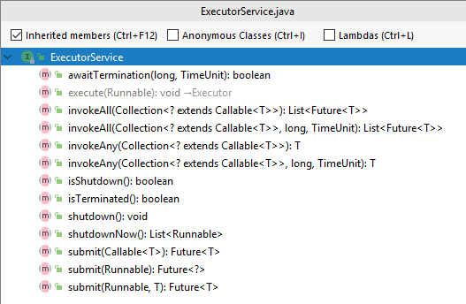

# Multi-threading/Java Concurrency

Students will: 
* Understand the fundamentals of concurrency in Java
* Be able to create and launch a thread using Thread or by subclassing Runnable interface
* Understand how to deal with thread contention
* Estimate how many threads to use for an application
* Understand basic concurrency components introduced in Java 5

- Topics:
  - Why concurrency
  - How to create a Thread
  - The Runnable interface
  - How many threads are correct?
  - synchronized keyword
    - Native locks are reentrant 
  - Signalling threads using wait/notify - synchronization
  - Concurrency components:
    - Executors class
        - ExecutorService interface
        - Fixed Thread Pool
        - Cached Thread Pool
        - Scheduled Executor
    - Callable interface
    - execute vs. submit
    - Atomics components - AtomicInteger
    - ReentrantLock component
    - ReadWriteLock

- Activities:
   - Instructor lead - Start ten threads in a loop. 
   Make each write an integer to the console. See how the integers are not printed in order
   - Instructor lead - Portfolio pricing method
   - Student exercise
   Students will be able to 
      - Activity: 
- Sizing: 5 (biggest)

### Fundamentals of Concurrency
Until now, we have covered basic programs and program flow. We have seen how you can control the flow
of a program using things like `if` statements and `for` loops. However all of the programs we have 
seen so far have been synchronous. One thread running the program serially from beginning to end.

However nowadays computers have powers far beyond what we have seen thus far. Today's commodity computers have multiple CPU's
dozens or hundreds of cores, and even within a single core, Java spins threads to perform 
parallel processes.

# Why concurrency?
Why would we ever need to have multiple threads performing concurrent work?

Consider a web application with dozens (or millions!) of concurrent users. 
We would not expect each user to wait in line until the previous user is done; rather we 
want to handle these requests _concurrently_.

Or let's say our application requires a lot of processing such as database queries, file reads and writes, and URL connection handling, where there's lots of IO. Do we 
want each outgoing request to wait for the other to return before the next one starts? Wouldn\'t it be better
to have all of our requests process _concurrently_?

Or consider an application that needs additional input for its processing. A naive approach would be to save all of the state of the process, terminate the process, get the additional data, and then restart the original process. That approach requires a lot of housekeeping overhead, keeping track of things, especially if there are many such things going on. Wouldn\'t it be better if the process could spin a concurrent process to get the required data, without stopping itself, and then continuing when the data is available?

  All of these reasons and more explain why the designers of Java made the decision to include concurrency in the core JDK, making it perhaps the first language to do so.
  
## How to create a Thread
Threads a really easy to create. But with great simplicity comes great responsibility, and we will discuss some of the traps in a little while. For now let's create and start a thread.

There are two popular ways to create a thread, and you will see both heavily used:
* Override the Thread class, implementing the `run` method
* Implement the Runnable interface, and pass it to a Thread

Let's use both of these approaches to start a thread that writes the current time to System output every 5 seconds

## Override the Thread class
The _Thread_ class has a method called `public void run()` that is called implicitly when you _start_ your thread. 
In this approach, we will create a new class that extends Thread.
 and override the `run` method. Then we will call our class's `start` method, which will start the Thread and implicitly call 
 `run`. 
 
 Be sure to get this clear... you _implement run()_ but you _call start()_! Let's see an example:
 <details>
 <summary>TimeLogger - extending Thread</summary>
 
 ```java
import java.time.LocalTime;

public class TimeLogger extends Thread {
    @Override
    public void run() {
        try {
            while (true) {
                System.out.println(LocalTime.now());
                Thread.sleep(2000);
            }
        } catch (InterruptedException e) {
            Thread.currentThread().interrupt();
            System.out.println(e);
        }
    }

    public static void main(String[] args) {
        TimeLogger timeLogger = new TimeLogger();
        timeLogger.start();
        System.out.println("Thread was started");
    }
}
```
</details>

There's  lot going on here, so let's talk through it.
First we imported the LocalTime class, a convenient class for capturing time information. 

Next we implemented our TimeLogger class, which _extends Thread_.

Now comes the meat. We override the `Thread` class's `run` method. 
The first thing the run method does is to declare a _try catch_ block. Let's come back to that until after we review the rest of the code.

`Thread.run` normally does its job and then exits, terminating the Thread. However in our case, we don't want it to exit, we want it to keep printing, so we use a _while_ loop to continually execute our output statement. 

Next we create a new LocalTime object, which refers to the current time (`now()`) at the time of instantiation.

Since all of that is happening in a while loop, it will continue to loop forever without pause. But the requirement was to display the time every 5 seconds, so we must sleep for 5 seconds between loop iterations. To do that we call the _Thread.sleep()_ method, supplying the number of milliseconds to sleep, in this case 2 seconds is 2000 ms, so we call `Thread.sleep(2000)`. 

Finally we define the _main_ method, which launches our program. It _starts_ our new Thread by calling the `start()` method, (which implicitly calls the _run_ method, in a new Thread.)

Coming back to the try-catch block, notice that `Thread.sleep()` is declared to throw an _InterruptedException_. An InterruptedException is thrown when the thread's `interrupt()` method is called. This is usually done by frameworks or application servers, to initiate a smooth shutdown of the threads. Since InterruptedException is a checked exception, it must be caught. One side-effect of catching an InterruptedException, is that the thread's _interrupt_ flag is reset, meaning that it is no longer interrupted. To propagate the interrupt, we must set the interrupt flag once again, which is why we call `Thread.currentThread().interrupt()`.

Notice that we enclosed the while loop _inside_ the try catch. A common mistake even advanced programmers make is to do the opposite, and they enclose the try catch _inside the while loop_. Why is that wrong?

Well think about it. If the try catch would be inside the while, then imagine what would happen if someone calls the interrupt method. In that case, the exception would trap the interrupt, set the interrupt flag, and then loop again! The program would never end, even after an interrupt! So we fix that by including the while _inside_ the try catch. Now if an interrupt occurs, the while loop exits, and the catch block takes over, sets the interrupt flag, and exits, returning control to the caller.

This is a _very_ common idiom in Java concurrency - execute some activity in a loop, sleep, and catch the InterruptedException outside the loop.

Let's execute that program (Ctrl-Shift-F10 in IntelliJ.) Notice that our `while(true)` statement will never exit, so the only way to exit this program is to _kill_ it (Ctrl F2 or Command F2 in IntelliJ), or pull the plug!

The output looks like this:

```text
Thread was started
11:57:16.913
11:57:18.963
11:57:20.964
11:57:22.964
```
Do you see anything unusual there?

Notice that in our _main_ method, the first thing we did was to start our thread, and then secondly, we printed out "Thread was started". However in the output, we can see that "Thread was started" was logged first, even though it was declared last!

Why did that happen? Keep in mind that everything in Java runs in a thread. Even if you are creating an innocent little Hello, World application, Java implictly spins up a thread called the _main thread_ and executes the program in that thread.

Once the main thread called our Thread _start_ method, it launched a new Thread, that runs in its own time. Then our main thread resumed, which printed out the "Thread was started" message. Meanwhile back at the ranch, our new Thread was preparing itself, then it got into action and began its business of printing the current time.

## The Runnable interface
We have seen one way to create a Thread by overriding the Thread class. The second approach is to recognize that the Thread class has a constructor that accepts a _Runnable_ instance. Runnable is an interface with one method - `public void run()`. Using this approach, you construct a new Thread instance by passing a Runnable instance to the constructor, then you call your Thread's _start_ method, which will call your Runnable in a new Thread.

Here is the program:
<details>
  <summary>Time: Runnable version</summary>

```java
    public static void main(String[] args) {
        class TimeRunnable implements Runnable {

            @Override
            public void run() {
                try {
                    while (true) {
                        System.out.println(LocalTime.now());
                        Thread.sleep(2000);
                    }
                } catch (InterruptedException e) {
                    Thread.currentThread().interrupt();
                    System.out.println(e);
                }
            }

        }
        TimeRunnable timeRunnable = new TimeRunnable();
        Thread thread = new Thread(timeRunnable);
        thread.start();
        System.out.println("Thread was started");
    }

```
</details>


This approach is roughly similar to the previous approach. 
We create a class that implements Runnable. We construct a new instance, supplying a run method, and pass that to the Thread constructor. Then we start the thread. Hitting Ctrl-Shift-F10 to execute that, produces the same result as the first approach.

There are several advantages to the Runnable approach, one being that it can be slightly less overhead, and perhaps more important, that there are other ways to launch Runnable instances using frameworks such as Java's built in _Executors_ framework, which we will see soon.

## Using anonymous inner classes
There is another common idiom you should be aware of for creating threads using the Runnable interface, and that is using _Anonymous inner classes_. We won't be looking at those in detail, but you will see the syntax in your travels, and you should be aware of it.

In our second thread example, we created a new class called TimeRunnable, and then instantiated that and passed in the instance to the Thread class. There is some boiled plate code there - we should not need to assign a name to a class that we are only ever going to use once, in a very limited context? 

For such cases, Java allows you to create _Anonymous inner classes_, which are declared and used in-line, without having to name them. Contrast the following to the previous TimeRunnable version:
<details>
<summary>TimeLogger - implementing Runnable</summary>

```java
    public static void main(String[] args) {
        Runnable timeRunnable = new Runnable() {
            @Override
            public void run() {
                try {
                    while (true) {
                        System.out.println(LocalTime.now());
                        Thread.sleep(2000);
                    }
                } catch (InterruptedException e) {
                    Thread.currentThread().interrupt();
                    System.out.println(e);
                }
            }
        };
        Thread thread = new Thread(timeRunnable);
        thread.start();
        System.out.println("Thread was started");
    }
```
</detail>

The syntax looks a bit tricky at first glance. Basically the first line of the main method is declaring a new Runnable instance. But we are calling an anonymous constructor `new Runnable()` that is formed by implementing the `Runnable.run()` method.

To highlight the difference, compare the two versions. You can copy and paste the first version into IntelliJ, then copy the second version into you clipboard, right click and choose "Compare to Clipboard":


Just study the two lines that are different, and be aware of that syntax.

(Footnote: Another popular variation of the Runnable syntax is to use Lambda expressions, and we will learn more about those when we get to the lesson on Lambdas and Streams.)

## Race condition
Now it is entirely possible that our time printing thread could have started before our main thread got around to printing the "Thread was started" message, in which case "Thread was started" would have printed as the second message instead of the first. Each thread operates independently, and so the intercolation is unpredictable. This is known as a race condition, and sometimes that makes testing threaded code very difficult! A race condition essentially means that different threads execute independently, and so they can appear to randomly execute their steps in different orders.

This can have some interesting side effects, when trying to assign and access a shared variable from different threads.

## Activity - Instructor lead - Race condition
(Note to instructor, see the class RaceCondition)
Description: Let's set up two threads, which each change the value of a shared variable, and then inspects the variable to see if it is the value as set.

Let's  set up two threads to set and then check the value. Here is the first. The second is similar
<details>
<summary>Race Condition</summary>

```java
private long someSharedVariable;

Thread thread1 = new Thread(new Runnable() {
    @Override
    public void run() {
        while (true) {
            someSharedVariable = 0;
                if (someSharedVariable != 0) {
                    System.out.println("huh? Expected " + 0 + " but got " + 0 + "!");
                }
            }
        }
});
```

</detail>

The output is something like:
```text
huh? Expected 0!
huh? Expected 0!
huh? Expected -1!
huh? Expected 0!
huh? Expected 0!
huh? Expected -1!
huh? Expected -1!
huh? Expected 0!
huh? Expected 0!
huh? Expected 0!
huh? Expected 0!
huh? Expected 0!
huh? Expected -1!
huh? Expected -1!
```

## synchronized keyword
When you want to make absolutely sure that two threads cannot execute at the same time, you can _lock_ those calls. The low level way to do that is using the _synchronized_ keyword. That was in fact the only way, until Java 5, and it is very common. The other way was using the java.util.concurrent package, introduced in Java 5. More on that later.

For now, let's look at the _synchronized_ keyword.
When you declare methods as _synchronized_, then that ensures that only one thread at a time can be executing any of the synchronized methods on any given object. The reason this works, is that every object instance has built in to it what is called an "intrinsic lock". When a thread enters a synchronized method, it automatically grabs that lock. If any other threads try to access a synchronized method while one thread already has the lock, then the other threads must _block_ until the current thread relinquishes the lock by exiting the synchronized block. When a thread is blocked, there is absolutely no way for it to move at all, until the lock is relinquished or the program ends. If many threads are waiting for the lock on an object, there is no guaranty that they will acquire the locks fairly, and it is possible that any given thread will have to wait indefinitely, depending on the volume of threads. The bottom line is be careful how you synchronize, and try to visualize all of the execution paths. Later on in this lesson, we will learn about the _ReentrantLock_, that allows you to lock in a fair way.

One more important note about the intrinsic lock.

Let's say you have two methods, both synchronized;
```text
public synchronized void myFirstMethod() {...}
public synchronized void myOtherMethod() {...}
``` 
Now if some thread #1 comes along and calls myFirstMethod, and thread #2 comes along and calls myOtherMethod while thread #1 is holding the lock, then thread #2 will block, as we said. However, let's say myFirstMethod calls myOtherMethod, and they are both synchronized. Then even though thread #2 will block when it calls myOtherMethod, nonetheless, thread #1 can still call myOtherMethod without blocking, since it already has the lock, so the synchronized keyword in that case has no effect.
<details>
<summary>Intrinsic Lock is Reentrant</summary>

```java
public synchronized void myFirstMethod() {
    ...
    myOtherMethod();
    ...
}
public synchronized void myOtherMethod() {
    // thread #1 can enter myOtherMethod even though it is in the synchronized method myFirstMethod
}
```
</details>

One final note on the _synchronized_ syntax. When you add _synchronized_ to a method, you are in effect saying, "lock on this object". However you can choose to lock on different objects, using the related syntax:
`synchronized(someObject)`

When we create an object for the sake of using its lock, we call that object a "_mutex_". Be sure that when you are using an object as mutex, that variable is not going to change its value, because the lock belongs to the value not the variable. Generally you want to declare those mutex  variables to be _final_ to prevent any reassignment. 

Let's modify our class above to use synchronized and see how that works:
<details>
<summary>Synchronized</summary>

```java
private final Object MUTEX = new Object();

Thread thread1 = new Thread(new Runnable() {
    @Override
    public void run() {
        synchronized (MUTEX) {
            while (true) {
                someSharedVariable = 0;
                if (someSharedVariable != 0) {
                    System.out.println("huh? Expected " + 0 + " but got " + 0 + "!");
                }
            }
        }
    }
});
```
</details>

Thankfully, when we synchronize, our updates and accesses are guaranteed to occur atomically, in the same thread, and so we see there is none of the surprised output like we saw in the initial version.

Note that using the synchronized method approach, if you have different instances of that class, all bets are off, and it is entirely permissible for different threads to access those methods on different object instances. If you want to lock a method across _all_ object instances of that class, then you can make that method synchronized. There are a few variations, but in this course we will not look further into that approach.
 
## Signalling threads using wait/notify/notifyAll
We learned about grabbing an intrinsic lock on an object.
There is a useful idiom we need to learn, that will help us in situations where some Thread 1 must _wait_ for another Thread 2 to complete,
and then continue. In such cases we can use Java's built-in _wait-notify_ mechanism.
`wait` and `notify` are both methods on the Object class, so every Java class inherits those,and they should never be overridden. 

### wait
If a thread owns the intrinsic lock on a mutex, and it wants to wait for some condition to be true before resuming, then it can call the `wait` method on the mutex, which will send the calling thread into a _waiting_ state. There are actually two flavors of `wait`. The first takes no arguments, and will wait forever (until notified, as we will see shortly.) The second takes a long argument, which represents the number of milliseconds to wait. If the time lapses, our thread exits the wait state, and is now runnable.(Passing in a value of 0 is equivalent to the no-parameter version, and will wait forever.)

We said earlier that when a thread grabs an intrinsic lock (by entering a synchronized block) then no other thread can enter that synchronized block (or any block that is synchronized on that object.)

We need to refine that statement slightly. When a thread is in the wait state, it _temporarily forfeits the lock_ it is waiting on, and the lock becomes available for another thread to take. 

So if a thread is in the timed-wait state and the time lapses, we said our thread exits the wait state, and is now runnable. Again we need to refine that slightly, because if another thread is already holding the lock then when our thread exits the wait state, then the thread enters the _blocked state_, until the lock becomes available again.


### notify/notifyAll
Now let's say our thread is moving merrily along, until it comes to a point where it needs to wait for some data to be available from another thread. This is a very common concurrency idiom, and Java provides the `notify` and `notifyAll` keywords to solve it.

It's easier to see it in an example.  Let's say we have two thread, one that is reading file data (the _reader_ thread, and another that is formatting and displaying that data (the _writer_ thread).

Now there is no reason for the writer to write anything, until the reader has read something. So the reader must have a way to signal to the writer that data is available. This is where wait/notify comes in handy.

Here is the program.  Let's  study what it is doing:
<details>
<summary>Wait-Notify</summary>

```java
package com.generalassembly.concurrency;

import java.io.File;
import java.io.IOException;
import java.nio.file.Files;
import java.nio.file.Paths;

public class ReaderWriterExample {
    private Object mutex = new Object();
    private volatile int index = 0;
    String[] files = {
            "Concurrency/resources/flatland.txt",
            "Concurrency/resources/war-and-peace.txt",
            "Concurrency/resources/sherlock-holmes.txt",
    };

    String[] values = new String[3]; // allocate 3 slots, but for now, leave them null
    public void launch() {
        System.out.println(new File(".").getAbsolutePath());
        Thread reader = new Thread(new Runnable() {
            @Override
            public void run() {
                for(index = 0; index < files.length; index++) {
                    try {
                        byte[] strings = Files.readAllBytes(Paths.get(files[index]));
                        String string = new String(strings);
                        values[index] = string;
                        synchronized (mutex) {
                            mutex.notify();
                        }
                        Thread.sleep(2000);
                    } catch (IOException e) {
                        e.printStackTrace();
                    } catch (InterruptedException e) {
                        Thread.currentThread().interrupt();
                    }
                }
                System.exit(0);
            }
        });
        Thread writer = new Thread(new Runnable() {
            @Override
            public void run() {
                while(true) {
                    try {
                        synchronized (mutex) {
                            mutex.wait();
                            System.out.println(values[index]);
                        }
                    } catch (InterruptedException e) {
                        Thread.currentThread().interrupt();
                    }
                }
            }
        });
        writer.start();
        reader.start();
    }

    public static void main(String[] args) {
        new ReaderWriterExample().launch();
    }
}
``` 
</details>

In this example, a reader thread reads a file, then stores it in an array, storing the index to the array in a shared variable called `index`. Then it sleeps for two seconds. 

Note that after the reader thread has read the file, it stores the result in our array, and then it _notifies_ the writer thread to do its job.

The call to `notify` immediately wakes up the writer thread, which then grabs the newly stored value, writes it to standard out, and then goes back to the wait state until it is notified to wake up again.

In our example, the call to `notify` wakes up the waiting thread. This works great because we only created one waiting thread. But what happens if you have many waiting threads? A call to notify will wake up one of the waiting threads at random, which is often what you want.  However there are times you want all waiting threads to wake. In that case you would call `notifyAll`, which will notify every waiting thread to wake up. (The observant student will notice that all threads are in the same synchronized block, so how can they all wake at the same time? The answer is they can't. Notify will change all waiting threads from the waiting state to the blocked state, waking up one thread at random. As each thread relinuishes the lock, another thread will be selected at random to become runnable, etc, until ever thread has had a chance.)

Incidentally, notice the keyword _volatile_, which is used before the declaration of the index variable.

This is a deep concept. The JVM will generally make a local copy of variables that are used by each thread, and the thread has the right to assume that the value will not be changed by any other thread.

If one thread modifies that variable, due to a JVM optimization, Java makes no guarantees that that the change will be seen by another thread, unless we mark the variable _volatile_, which tells the JVM to read the value of the variable on every access, instead of using the thread's local copy. The reason this is done is an optimization because accessing memory by threads across CPUs and cores can be a relatively slow operation.

## Concurrency components
Until Java 5 arrived on the scene, that was pretty much the extent of the concurrency support. You basically were given the low level functionality, but building things like thread pools (to dispatch pools of threads), or semaphores (like locks except with more than one permit), were left to the programmer.

Java 5 changed all that with the introduction of the java.util.concurrent package, which provided a rich set of components for handling many important concurrency design patterns. We will go through the important ones now.

## Executors class
So far we have seen how to create threads; but threads use resources, and it would be dangerous to have programs spin arbitrary numbers of threads. To control this, there is a concept of a _thread pool_. This is a component that allocates threads from a fixed pool, and once the pool is depleted, requests for more threads block, until threads are returned to the pool. 

In Java thread pools belong to the category of ExecutorServices, and are created using a factory class called _Executors_, which contains many static methods for creating different flavors of ExecutorService. Looking at the API for ExecutorService, there are methods for invoking, shutting down, and checking status.  
 
We will concentrate on construction, execute, and submit.
### Fixed Thread Pool

To construct a fixed thread pool, call `Executors.newFixedThreadPool(pool-size)`, passing in the number of threads to pool. For example:
```java
    private final ExecutorService threadPool = Executors.newFixedThreadPool(5);
```

(We made it private because we want all control to be in this class, and final so that we don't lose reference to it.)

That returns a new ExecutorService, which in this example we assigned to a variable called _threadPool_.

To use that thread pool, we call the `ExecutorService.execute(Runnable)` method, providing a Runnable instance. This is usually done by supplying an anonymous inner class or Lambda expression. Here is how it looks:
<details>
<summary>Executor Service</summary>

```java
        ExecutorService threadPool = Executors.newFixedThreadPool(3);
        threadPool.execute(new Runnable() {
            @Override
            public void run() {
                for (int i = 0; i < 5; i++) {
                    System.out.println(" This is thread 0" + " iteration " + i);
                    try {
                        Thread.sleep(1000);
                    } catch (InterruptedException e) {
                        Thread.currentThread().interrupt();
                    }
                }
            }
        });

```
</details>

We are creating a new Runnable, providing a Run method that iterates five times, printing out the thread number and the iteration.

Let's see what happens if we start 10 threads like that. Since we hate copy and paste code, let's do a bit of refactoring
<details>
<summary>ExecutorService in action</summary>

```java
    public static void main(String[] args) {
        ExecutorService threadPool = Executors.newFixedThreadPool(3);
        threadPool.execute(getRunnable(" This is thread 0"));
        threadPool.execute(getRunnable(" This is thread 1"));
        threadPool.execute(getRunnable(" This is thread 2"));
        threadPool.execute(getRunnable(" This is thread 3"));
        threadPool.execute(getRunnable(" This is thread 4"));
        threadPool.execute(getRunnable(" This is thread 5"));
        threadPool.execute(getRunnable(" This is thread 6"));
        threadPool.execute(getRunnable(" This is thread 7"));
        threadPool.execute(getRunnable(" This is thread 8"));
        threadPool.execute(getRunnable(" This is thread 9"));

    }

    private static Runnable getRunnable(String message) {
        return new Runnable() {
            @Override
            public void run() {
                for(int i = 0; i < 5; i++) {
                    System.out.println(message + " iteration " + i);
                    try {
                        Thread.sleep(1000);
                    } catch (InterruptedException e) {
                        Thread.currentThread().interrupt();
                    }
                }
            }
        };
    }
```
</details>

Now, the pool only has three threads, but we are calling it 10 times. Looking at the output, we see that the first three threads run until complete, whence the next three run, etc, until the end. 


## How many threads are correct?
How large should you make your thread pool? If each thread pinned the CPU, then you would generally want no more than one thread per CPU. So the idea is to look at CPU utilization for one thread, and divide that number into the number of CPUs. For example, if we have 4 cores, and the utilization from one thread is 20% per core, then the number of threads for 100% utilization would be 4/.2 = 20. If you need to exceed that, then it's probably time to start thinking about upgrading hardware. But don't make rash decisions until you test things, because Java is clever about context switching and swapping, so it will still work albeit marginally slower.

## Futures
A _Future_ in Java is a kind of promise, that data _will_ be available, and so until it does, you my friendly thread, will block if you try to access it.

To get the result of a Future, call its `get()` method, which blocks until there is something _to get_!

When you call `ExecutorService.submit method, it returns a Future.
 
### Scheduled Executor
An important flavor of ExecutorService is the _scheduled executor_. This calls its job repeatedly at fixed intervals. For example, let's say we created a job that checks for files on an ftp server, and when files are there, it processes them. Let's say our requirement is to check every 1 minute.
<details>
<summary>Scheduled Executor</summary>

```java
private void checkFtpServer(long period) {
    ScheduledExecutorService scheduledExecutor = Executors.newScheduledThreadPool(1);
    scheduledExecutor.scheduleAtFixedRate(checkAndProcessFile(), 0, period, TimeUnit.SECONDS);
}

```
</details>

In this example, we are creating a new scheduled thread pool, which is a kind of `ScheduledExecutorService`, and then scheduling our job at a fixed rate of `period` seconds, with an initial delay of 0. That will check for files and process them every `period` seconds, which is a good alternative to the sleep approach we have been using until now.

## Atomics components - AtomicInteger
Imagine you are creating a hit counter for a website. The naive implementation would say something like (in pseudocode):
```java
Line 1 value = getHitCounter()
Line 2 value = value+1
Line 3 setHitCounter(value)
```
Now that looks all well and good, except, what happens if two threads call this code using is an inauspicious inter-collation of events.

Let's say the hit counter is currently at 1000, when the two threads attack. Now follow me closely:
Thread 1 calls Line 1, gets value of 1000
Thread 2 calls Line 1, gets value of 1000 (since Thread 1 has not set the value yet!)
Thread 1 calls Line 2, increments its counter value to 1001 
Thread 2 calls Line 2, increments its counter value to 1001 
Thread 1 sets the hit counter to 1001
Thread 2 sets the hit counter to 1001

What just happened?? We had two threads, and we only incremented the hit counter by one!!

Now one solution to this would be to combine Lines 1, 2, and 3 into s single call, and synchronize it. 

But Java provides those semantics inherently, in its AtomicInteger class.

Let's see an example:
<details>
<summary>AtomicInteger</summary>

```java
package com.generalassembly.concurrency;

import java.util.concurrent.ExecutorService;
import java.util.concurrent.Executors;
import java.util.concurrent.atomic.AtomicInteger;

public class AtomicIntegerLesson {
    private final ExecutorService executor = Executors.newCachedThreadPool();
    private final AtomicInteger hitCounter = new AtomicInteger(0);

    private void hit() {
        int value = hitCounter.incrementAndGet();
        System.out.println(value);
    }

    private void spinThread() {
        executor.execute(() -> {
            for (int i = 0; i < 100; i++) {
                hit();
            }
        });
    }

    public static void main(String[] args) {
        AtomicIntegerLesson lesson = new AtomicIntegerLesson();
        lesson.launch(lesson);
    }

    private void launch(AtomicIntegerLesson atomicIntegerLesson) {
        for(int i = 0; i < 100; i++) {
            atomicIntegerLesson.spinThread();
        }
    }
}
```
</details>

In this example, the hit counter starts at 0. We are launching 100 threads, having each one hit the thread counter 100 times. If all goes well, the hit counter should reach 10,000. If there is even a single race condition, we will never see 10,000.

Running that application yields the log output:
```text
1
6
8
9
5
11
...
9996
9997
9998
9999
10000

Process finished with exit code 0
```
The good news is we reached 10000!

Don't be thrown by the fact that some of the numbers appear out of sequence; that's just the way the output was ordered by the thrashing threads. If you study the output carefully, you will see there is exactly one of each number from 1 to 10,000. 
 

## ReentrantLock component
## ReadWriteLock

  
  
