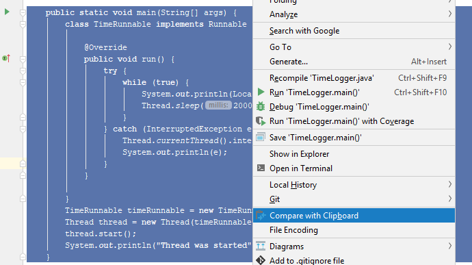
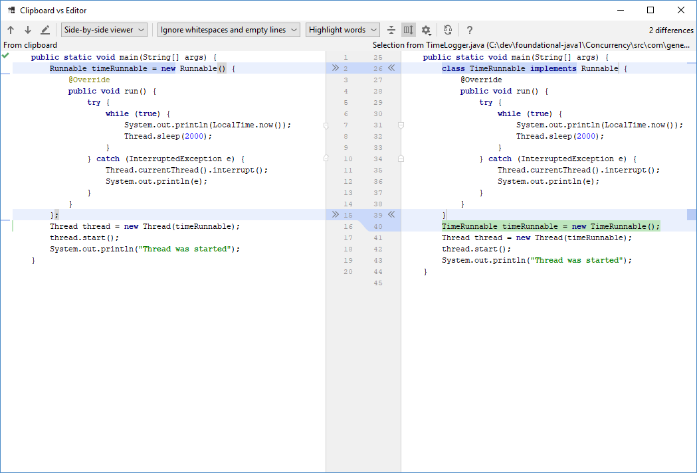
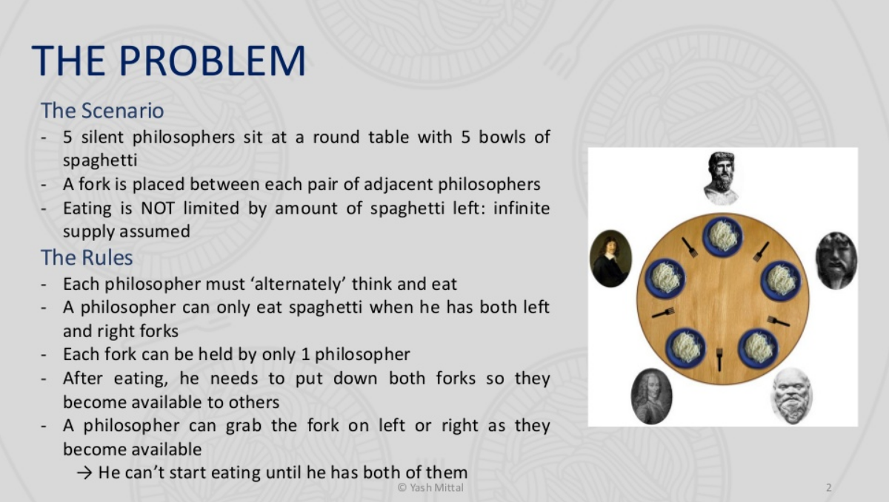
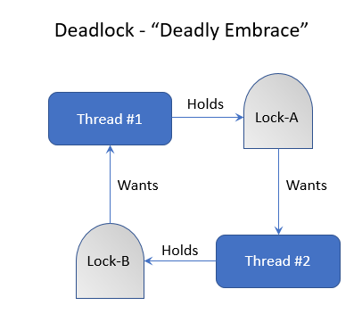

| Title | Type | Duration | Creator |
| --- | -- | -- | --- |
| Intro to Concurrency | Lesson | 2:50 | Victor Grazi, NYC |

#  Intro to Concurrency

### LEARNING OBJECTIVES

*After this lesson, you will be able to:*
- Explain the fundamentals of concurrency in Java.
- Create and launch a thread using Thread or by subclassing Runnable interface.
- Handle thread contention.

### LESSON GUIDE

| TIMING  | TYPE  | TOPIC  |
|:-:|---|---|
| 5 min  | Opening  | Discuss lesson objectives |
| 10 min | Introduction  | What's the Big Deal? |
| 20 min | Demo  | Override the Thread Class |
| 20 min | Demo  | The Runnable Interface  |
| 30 min | Independent Practice | Memory and Time |
| 20 min | Demo | Race Condition |
| 20 min | Demo | `Synchronized` |
| 20 min | Demo | Signalling Threads |
| 20 min | Discussion  | Concurrency Considerations |
| 5 min  | Conclusion  | Review / Recap |

## Opening (5 mins)

Until now, we have covered basic programs and program flow. We have seen how you can control the flow of a program using things like `if` statements and `for` loops. All of these programs have been _synchronous_; the programs run step-by-step, consecutively, from beginning to end.

Today's computers have powers far beyond what we have seen or used thus far. Even the simplest computers have multiple CPUs and dozens or hundreds of cores. Even within a single core, Java spins "threads" to perform parallel processes. That's what we mean by concurrency - many threads working at the same time.

> Fun history lesson: The designers of Java included concurrency in the core JDK, making it perhaps the first language to do so.

So, let's turn our programs up to 11 by introducing them to concurrency.

--- 

## What's The Big Deal? (10 min)

Before we dive in, let's think: Why would we ever need to have multiple threads performing concurrent work?

Amazon, for example, might have dozens (or millions!) of customers using the site at the same time. Many of them are trying to perform a similar task - purchase a shiny new gadget. To complete the purchase, users certainly don't want to wait in line until all of the previous users are done. That's why they're online shopping! We expect the web application to handle these requests _concurrently_.

Or, think of an application that requires a lot of database queries, file reads and writes, and calling other services over a network. Do we 
want each outgoing request to wait for the other to return before the next one starts? Wouldn't it be better to have all of our requests process _concurrently_?

### Threads

The backbone of Java concurrency are **threads**. A thread is a lightweight process that has its own call stack but can access shared data of other threads in the same process.

Threads are really easy to create, but with great simplicity comes great responsibility! We'll discuss some of the common pitfalls in a little while, but for now, let's jump straight into creating and starting our very first thread.

There are two popular ways to create a thread, and you will see both heavily used:
* **Override the Thread class**, implementing the `run` method.
* **Implement the Runnable interface**, implementing its `run` method, and pass that Runnable to a Thread.

Let's use both of these approaches to start a thread that is tasked with the job of writing the current time to System output every 2 seconds.

----

## Override the Thread Class (20 min)

In this approach, we will create a new class that _extends_ `Thread` and _overrides_ that thread's `run()` method. 

The `Thread` class has a method called `public void run()` that is called implicitly when you _start_ your thread. 

Once we overrride `Thread.run()`, we will call our class's `start()` method, which will start the thread and implicitly call `run()`. 
 
 > Reminder: Be sure to get this clear... you _implement_ `run()` but you _call_ `start()`! Tricky! 

Let's walk-through an example. Remember, we're starting a thread that will print the current time every 2 seconds.

**TimeLogger: Extending the Thread Class**
 
```java
import java.time.LocalTime;

public class TimeLogger extends Thread {
    @Override
    public void run() {
        try {
            while (true) {
                System.out.println(LocalTime.now());
                Thread.sleep(2000);
            }
        } catch (InterruptedException e) {
            Thread.currentThread().interrupt();
            System.out.println(e);
        }
    }

    public static void main(String[] args) {
        TimeLogger timeLogger = new TimeLogger();
        timeLogger.start();
        System.out.println("Thread was started");
    }
}
```

There's a lot going on here, so let's talk through it.

#### Step 1

First we imported the `LocalTime` class, which is a convenient class for capturing time information and has nothing to do with threading itself.

```java
import java.time.LocalTime;
```

#### Step 2

Next, we implemented our `TimeLogger` class, which _extends_ `Thread`.

```java
public class TimeLogger extends Thread {
	}
```

#### Step 3

Now comes the meat. 

```java
@Override
public void run() {
        try {
            while (true) {
                System.out.println(LocalTime.now());
                Thread.sleep(2000);
            }
        } catch (InterruptedException e) {
            Thread.currentThread().interrupt();
            System.out.println(e);
        }
}
```

We overrode the `Thread` class's `run()` method. The first thing the run method does is to declare a _try-catch_ block. 

We surround code that can throw an exception with the `try` portion, and make some code to gracefully handle the exception in the `catch` portion.

`Thread.run` normally does its job and then exits, terminating the Thread. But in our case, we don't want it to just print once and exit; we want it to keep printing the current time, so we use a _while_ loop to continually execute our output statement. 

Next, we create a new `LocalTime` object, which refers to the current time (`now()`) at the time of instantiation.

Since all of that is happening in a _while_ loop, it will continue to loop forever without pause. But the requirement was to display the time every 2 seconds, so we must sleep for 2 seconds between loop iterations. To do that, we call the _Thread.sleep()_ method, supplying the number of milliseconds to sleep, in this case 2 seconds is 2000 ms, so we call `Thread.sleep(2000)`. 

#### Step 4

Finally, we define the `main()` method, which launches our program. It _starts_ our new thread by calling the `start()` method, which implicitly calls the `run()` method, in a new thread.

```java
public static void main(String[] args) {
        TimeLogger timeLogger = new TimeLogger();
        timeLogger.start();
        System.out.println("Thread was started");
}
```    

> Note: We get the implementation of the `start()` method from the `Thread` class which we're extending. That's why we don't have to write it ourselves!

#### What About That Try-Catch Block?

Notice that `Thread.sleep()` throws an `InterruptedException`. That exception is thrown when the thread's `interrupt()` method is called (usually by frameworks or application servers) to initiate a smooth shutdown of the threads. Since `InterruptedException` is a checked exception, by definition, you _must_ catch it. One side-effect of catching an `InterruptedException` is that the thread's _interrupt_ flag is reset, meaning that it is no longer interrupted, which means that the container shutdown will be aborted. 

To propagate the interrupt back to the calling thread (so that the application server or container can continue its clean shutdown), we must set the interrupt flag once again, which is why we call `Thread.currentThread().interrupt()`. 

That being said, it's not critical to understand the inner workings here (*wipes sweat from brow*). Just remember to follow the recipe: 

> **Whenever you catch an `InterruptedException`, call `Thread.currentThread().interrupt()` before exiting the catch block.**

Also, notice that we enclosed the while loop _inside_ the try-catch. A common mistake even advanced programmers make is to do the opposite, and they enclose the try-catch _inside the while loop_. Why is that wrong?

Think about it. If the try catch was inside the while loop, imagine what would happen if someone calls the interrupt method. The exception would trap the interrupt, set the interrupt flag, and then loop again! The program would never end, even after an interrupt! So we fix that by including the while _inside_ the try catch. If an interrupt occurs, the while loop exits and the catch block takes over, sets the interrupt flag, and exits, returning control to the caller.

> Hint: This is a _very_ common idiom in Java concurrency: execute some activity in a loop, sleep, and catch the `InterruptedException` outside the loop. Now you know!

#### Make it Run!

Let's execute that program using the keyboard shortcut _Ctrl-Shift-F10_ in IntelliJ. Notice that our `while(true)` statement will never exit, so the only way to exit this program is to _kill_ it (_Ctrl-F2_ or _Command-F2_ in IntelliJ), or pull the plug!

The output looks like this:

```text
Thread was started
11:57:16.913
11:57:18.963
11:57:20.964
11:57:22.964
```

> Check: Do you see anything funny there?

Notice that in our _main_ method, the first thing we did was to start our thread. Then, we printed out "Thread was started". However in the output, we can see that "Thread was started" was logged first, even though it was declared last!

**Why did that happen?**

Keep in mind that everything in Java runs in a thread. Even if you are creating an innocent little "Hello, World" application, Java implictly spins up a thread called the _main thread_ and executes the program in that thread.

Once the main thread calls our Thread `start()` method, it launches a new thread that runs in its own time. Then our main thread resumes, printing out the "Thread was started" message. Meanwhile back at the ranch, our new Thread was preparing itself before it got into action and began its business of printing the current time.

-----

## The Runnable Interface (20 min)

The second approach is to recognize that the `Thread` class has a constructor that accepts a _Runnable_ instance. 

Runnable is an interface with one method - `public void run()`. Using this approach, you construct a new Thread instance by passing a Runnable instance to the constructor, then call your Thread's _start_ method, which will call your Runnable in a new Thread.

> Tip: A "Runnable" instance is an instance of a class that _implements_ the `Runnable` interface.

**Here's how we could refactor our time program:**

```java
public static void main(String[] args) {
    class TimeRunnable implements Runnable {
        @Override
        public void run() {
            try {
                while (true) {
                    System.out.println(LocalTime.now());
                    Thread.sleep(2000);
                }
            } catch (InterruptedException e) {
                Thread.currentThread().interrupt();
                System.out.println(e);
            }
        }

    }

    TimeRunnable timeRunnable = new TimeRunnable();
    Thread thread = new Thread(timeRunnable);
    thread.start();
    System.out.println("Thread was started");
}
``` 

> Check: What's going on here? What differences between the two approaches do you see right off the bat?

1. We create a class that implements `Runnable`. 
1. We construct a new instance, supplying a `run()` method and pass that to the `Thread` constructor. 
1. Then we start the thread. 
1. Run it - we'll get the same result as the first approach.

### Which one wins?

This approach is roughly similar to the previous approach. **So why use one over the other?**

There are several advantages to the `Runnable` approach:
- It can be slightly less overhead.
- Even more importantly, there are other ways to launch `Runnable` instances using frameworks such as Java's built in _Executors_ framework, which we will see soon.

### Using Anonymous Inner Classes

There is another common idiom you should be aware of for creating threads using the `Runnable` interface: Using _anonymous inner classes_. We won't be looking at this approach in much detail, but you will see the syntax in your travels, and you should be aware of it. 

The idea behind anonymous inner classes is that we should not need to assign a name to a class that we are only ever going to use once in a very limited context. For such cases, Java allows you to create _anonymous inner classes_, which are declared and used in-line, without having to name them.

> Aside: You may have seen anonymous functions in a language like JavaScript. The motivation for doing so here is exactly the same!

In our second thread example, we created a new class called `TimeRunnable`, and then instantiated that and passed in the instance to the `Thread` class. 

Contrast this code, which uses an anonymous inner class, to the previous `TimeRunnable` version:

```java
public static void main(String[] args) {
    Runnable timeRunnable = new Runnable() {
        @Override
        public void run() {
            try {
                while (true) {
                    System.out.println(LocalTime.now());
                    Thread.sleep(2000);
                }
            } catch (InterruptedException e) {
                Thread.currentThread().interrupt();
                System.out.println(e);
            }
        }
    };

    Thread thread = new Thread(timeRunnable);
    thread.start();
    System.out.println("Thread was started");
}
```

> Check: What jumps out at you here?

The syntax looks a bit tricky at first glance. Basically, the first line of the `main()` method is declaring a new `Runnable` instance, but we are calling an anonymous constructor (`new Runnable()`) that is formed by implementing the `Runnable.run()` method.

To highlight the difference, compare the two versions. You can copy and paste the first version into IntelliJ, then copy the second version into you clipboard, right click and choose "Compare to Clipboard":





Study the two lines that are different and compare the syntax.

----

## Independent Practice: Memory and Time (30 min)

We want to capture some metrics in our logs to ensure that our application is properly executing and that there is enough memory.

**Your task:**
* Create an application that spins two extra threads.  
* The first thread logs the system time every six seconds. 
* The second thread logs the total memory and free memory every 1.5 seconds.

**CHALLENGE:** Most seasoned developer are allergic to copy and paste code, so try not to use any duplicated code! 

> Hint: In order to get the current time, call `LocalTime.now()`. To get the free memory, call `Runtime.freeMemory()`. To get the total memory, call `Runtime.totalMemory()`. 

<details>
<summary>Solution: Memory and Time Threads</summary>

```java
public class FreeMemoryAndTime {
    public static void main(String[] args) {
        spinThread(new MemoryPrinter(), 6_000);
        spinThread(new TimePrinter(), 1_500);
    }

    interface Printer {
        void printMessage();
    }
    static class TimePrinter implements Printer {

        @Override
        public void printMessage() {
            System.out.println("Current time: " + LocalTime.now());
        }
    }
    static class MemoryPrinter implements Printer {

        @Override
        public void printMessage() {
            System.out.println("Free memory: " + Runtime.getRuntime().freeMemory() + " Total memory: " + Runtime.getRuntime().totalMemory());
        }
    }
    private static void spinThread(Printer printer, long delay) {
        Thread thread = new Thread(new Runnable() {
            @Override
            public void run() {
                while (true) {
                    printer.printMessage();
                    try {
                        Thread.sleep(delay);
                    } catch (InterruptedException e) {
                        Thread.currentThread().interrupt();
                    }
                }
            }
        });
        thread.start();
    }
}

```

**What are those underscores?**

Underscores in numeric literals are ignored in Java and used for readability. In the code below, the `delay` is a time in miliseconds, which is difficult to read. Putting the underscore in lets us easily identify that the sleep timer of the threads waits for 60 and 15 seconds respectively on each iteration.

</details>

----

## Race Condition (20 min)

It is entirely possible that our time-printing thread could have started before our main thread got around to printing the "Thread was started" message. If that happened, "Thread was started" would have printed as the second message instead of the first. 

Each thread operates independently, and so the intercolation is unpredictable. In plain English, this basically means we can't know the order they will happen ahead of time. This is known as a **race condition**, and sometimes that makes testing threaded code very difficult! A race condition essentially means that different threads execute independently, and so they can appear to randomly execute their steps in different orders.

This can have some interesting side effects, when trying to assign and access a shared variable from different threads.


<!-- https://image.slidesharecdn.com/intro2concurrency-180306214554/95/brief-introduction-to-concurrent-programming-15-638.jpg -->

### Code-along: Race Conditions

Let's set up two threads, which each change the value of a shared variable, and then inspects the variable to see if it is the value as set.

<!-- code in com.generalassembly.concurrency.RaceCondition -->
```java
public class RaceCondition {
    private long someSharedVariable;
    private void launch() {

        Thread thread1 = new Thread(new Runnable() {
            @Override
            public void run() {
                while (true) {
                    someSharedVariable = 0;
                        if (someSharedVariable != 0) {
                            System.out.println("huh? Expected " + 0 + " but got " + 0 + "!");
                        }
                    }
                }
        });

        Thread thread2 = new Thread(new Runnable() {
            @Override
            public void run() {
                while (true) {
                    someSharedVariable = -1;
                        if (someSharedVariable != -1) {
                            System.out.println("huh? Expected " + -1 + " but got " + -1 + "!");
                        }
                    }
                }
        });
        thread1.start();
        thread2.start();
    }

    public static void main(String[] args) {
        new RaceCondition().launch();
    }
}
```

The output might look something like this:

```text
huh? Expected 0 but got 1!
huh? Expected 0 but got 0!
huh? Expected 0 but got 1!
huh? Expected 0 but got 0!
huh? Expected 0 but got 0!
huh? Expected 0 but got 1!
huh? Expected 0 but got 1!
huh? Expected 0 but got 0!
```

**What's going on?**

*Up is down? Left is right? 0 is 1?!*

Whoa! Don't worry, there is actually a logical explanation for this behavior! You have to realize that thread1 is continually setting `someSharedVariable` to 0, and thread2, operating at the same time, is trying to set it to -1. At any given time, we don't know who touched the shared variable last! So it's less of a logical contradiction so much as two siblings who are both fighting over who gets to play with a toy, but it's pretty clear even from this small example that threading and concurrency can lead to some trippy behavior!

----

## The `synchronized` Keyword (20 min)

When you want to make absolutely sure that two threads cannot execute at the same time, you can _lock_ those calls. The low level way to do that is using the _synchronized_ keyword. 

> History lesson: That was in fact the only way until Java 5, and it is very common. 

The other way is using the `java.util.concurrent` package, introduced in Java 5. We'll introduce that later. Let's take a look at that _synchronized_ keyword.

When you declare methods as `synchronized`, that ensures that _only one thread at a time_ can be executing any of the synchronized methods on any given object. 

This works because every object instance has built in to it what is called an "intrinsic lock". When a thread enters a synchronized method, it automatically grabs that lock. If any other threads try to access a synchronized method while one thread already has the lock, then the other threads must _block_ until the current thread relinquishes the lock by exiting the synchronized block. When a thread is blocked, there is absolutely no way for it to move at all, until the lock is relinquished or the program ends. If many threads are waiting for the lock on an object, there is no guarantee that they will acquire the locks fairly, and it is possible that any given thread will have to wait indefinitely, depending on the volume of threads. 

The bottom line is be careful how you synchronize, and try to visualize all of the execution paths. 

**Seems a little unfair doesn't it?**


Have you ever been in a grocery line trying to buy one item behind someone buying 100 items? Or have you been waiting in a customer service line while whoever is in front of you had a complex problem? You were left waiting indefinitely, and if the person in front of you felt like taking more time you'd have no choice but to just wait and wait! It turns out, we don't like our Java threads to wait on hold either! Java also has a _ReentrantLock_, that allows you to lock in a fair way. For more information, see the [Java docs](https://docs.oracle.com/javase/8/docs/api/java/util/concurrent/locks/ReentrantLock.html).

One more important note about the intrinsic lock. Consider the following example. Let's say you have two methods, both synchronized:

```text
public synchronized void myFirstMethod() {...}
public synchronized void myOtherMethod() {...}
``` 

If some thread #1 comes along and calls `myFirstMethod`, and thread #2 comes along and calls `myOtherMethod` while thread #1 is holding the lock, then thread #2 will block, as we said. However, let's say myFirstMethod calls `myOtherMethod`, and they are both synchronized. Then even though thread #2 will block when it calls myOtherMethod, nonetheless, thread #1 can still call myOtherMethod without blocking, since it already has the lock, so the synchronized keyword in that case has no effect.

<details>
<summary>Intrinsic Lock is Reentrant</summary>

```java
public synchronized void myFirstMethod() {
    // Other contents
    myOtherMethod();
    // More contents
}
public synchronized void myOtherMethod() {
    // thread #1 can enter myOtherMethod even though it is in the synchronized method myFirstMethod
}
```
</details>

### Mutex

One final note on the _synchronized_ syntax. When you add _synchronized_ to a method, you are in effect saying, "lock on this object". However you can choose to lock on different objects, using the related syntax: `synchronized(someObject)`

When we create an object solely for the purpose of using its lock, we call such an object a "_mutex_". Be sure that when you are using an object as a mutex, that variable is not going to change its value, because the lock belongs to the value not the variable. Generally, you want to declare those mutex variables to be _final_ to prevent any reassignment, and capitalize the entire variable name, to indicate that is it final, as we mentioned in our "Data Types and Variables" lesson. 

Let's modify our class above to use synchronized and see how that works:

<!-- code in com.generalassembly.concurrency.SynchronizedRaceCondition-->
```java
    private long someSharedVariable;
    private final Object MUTEX = new Object();
    private void launch() {

        Thread thread1 = new Thread(new Runnable() {
            @Override
            public void run() {
                synchronized (MUTEX) {
                    while (true) {
                        someSharedVariable = 0;
                        if (someSharedVariable != 0) {
                            System.out.println("huh? Expected " + 0 + " but got " + 0 + "!");
                        }
                    }
                }
            }
        });

        Thread thread2 = new Thread(new Runnable() {
            @Override
            public void run() {
                synchronized (MUTEX) {
                    while (true) {
                        someSharedVariable = -1;
                        if (someSharedVariable != -1) {
                            System.out.println("huh? Expected " + -1 + " but got " + -1 + "!");
                        }
                    }
                }
            }
        });
        thread1.start();
        thread2.start();
    }

```

In this code, we declare a _mutex_ object. Note that the variable name `MUTEX` is capitalized to indicate that it is final.

This is a common practice - we declare a mutex variable, then all code that accesses the shared variable synchronizes on the mutex, ensuring that those accesses cannot run concurrently, preventing the race condition.

Thankfully, when we synchronize, our updates and accesses are guaranteed to occur atomically, in the same thread, and so we see there is none of the surprised output like we saw in the initial version.

Note that using the synchronized method approach, if you have different instances of that class, it is entirely permissible for different threads to access those methods on _different_ object instances. If you want to lock a method across _all_ object instances of that class, then you can make that mutex static. There are a few variations, but in this course we will not look further into that approach.

### Side Note: Being Atomic

Atomic is a common word in computer science. It refers to a set of two or more events that all must either happen or not happen. A common example would be a credit card transaction... a user goes on line, orders a book, and her credit card is denied. Or, her credit card is debited, but the book is out of stock.    

Now you might ask - why not just check that the book is in stock and that there is enough available credit, before executing the transaction? But when you think about it, that won't help, because what happens if just after you check, the last copy of the book gets sold, or the last dollar of credit gets used up? For these cases we need to ensure that the events are _atomic_ - they happen all or nothing.

The two events - ordering the book and debiting the credit card, must occur "atomically" - you don't ever want a situation where the merchandise gets shipped, but the credit card was rejected, or arguably worse - where the credit card was billed but the order was never shipped. Atomic transactions ensure that in a multi-step transaction such as this, either all of the steps of the transaction complete, or none of them do, (i.e. they all "roll-back").

-----
 
## Signalling Threads Using wait/notify/notifyAll (20 min)

We just learned about grabbing an intrinsic lock on an object.

There is a useful idiom we need to learn that will help us in situations where some Thread 1 must _wait_ for another Thread 2 to complete, and then continue. In such cases, we can use Java's built-in _wait-notify_ mechanism. Methods `wait` and `notify` are both from the `Object` class, so every Java class inherits those, and they should never be overridden. 

### Object.wait()

If a thread owns the intrinsic lock on a mutex, and it wants to wait for some condition to be true before resuming, then it can call the `wait` method on the mutex, which will send the calling thread into a _waiting_ state. 

There are actually two flavors of `wait`:
- The first takes no arguments, and will wait forever (until notified, as we will see shortly.) 
- The second takes a long argument, which represents the number of milliseconds to wait. If the time lapses, our thread exits the wait state, and is now runnable. (Passing in a value of 0 is equivalent to the no-parameter version, and will wait forever.)

We said earlier that when a thread grabs an intrinsic lock, no other thread can enter that synchronized block (or any block that is synchronized on that object.)

We need to refine that statement slightly. When a thread is in the wait state, it _temporarily forfeits the lock_ it is waiting on, and the lock becomes available for another thread to take. 

So if a thread is in the timed-wait state and the time lapses, we said our thread exits the wait state, and is now runnable. Again we need to refine that slightly, because if another thread is already holding the lock then when our thread exits the wait state, then the thread enters the _blocked state_, until the lock becomes available again.


### notify/notifyAll

Now, let's say our thread is moving merrily along, until it comes to a point where it needs to wait for some data to be available from another thread. This is a very common concurrency idiom, and Java provides the `notify` and `notifyAll` keywords to solve it.

It's easier to see it in an example. Let's say we have two threads, one that is reading file data (the _reader_ thread, and another that is formatting and displaying that data (the _writer_ thread).

Now there is no reason for the writer to write anything, until the reader has read something. So the reader must have a way to signal to the writer that data is available. This is where wait/notify comes in handy.

Copy and paste the following code into a single Java source file, named _ReaderWriterExample_ in package com.generalassembly.concurrency. 

This program will start two threads. The first will read three popular books in turn, and then notify the second thread to start processing. The second thread will wake and display the contents of each:

<details>
<summary>Wait-Notify</summary>

```java
package com.generalassembly.concurrency;

import java.io.File;
import java.io.IOException;
import java.nio.file.Files;
import java.nio.file.Paths;

public class ReaderWriterExample {
    private final Object MUTEX = new Object();
    private volatile int index = 0;
    String[] files = {
        "Concurrency/resources/flatland.txt",
        "Concurrency/resources/war-and-peace.txt",
        "Concurrency/resources/sherlock-holmes.txt",
    };

    String[] values = new String[3]; // allocate 3 slots, but for now, leave them null
    public void launch() {
        System.out.println(new File(".").getAbsolutePath());
        Thread reader = new Thread(new Runnable() {
            @Override
            public void run() {
                for(index = 0; index < files.length; index++) {
                    try {
                        byte[] strings = Files.readAllBytes(Paths.get(files[index]));
                        String string = new String(strings);
                        values[index] = string;
                        synchronized (MUTEX) {
                            MUTEX.notify();
                        }
                        Thread.sleep(2000);
                    } catch (IOException e) {
                        e.printStackTrace();
                    } catch (InterruptedException e) {
                        Thread.currentThread().interrupt();
                    }
                }
                System.exit(0);
            }
        });
        Thread writer = new Thread(new Runnable() {
            @Override
            public void run() {
                while(true) {
                    try {
                        synchronized (MUTEX) {
                            MUTEX.wait();
                            System.out.println(values[index]);
                        }
                    } catch (InterruptedException e) {
                        Thread.currentThread().interrupt();
                    }
                }
            }
        });
        writer.start();
        reader.start();
    }

    public static void main(String[] args) {
        new ReaderWriterExample().launch();
    }
}
``` 
</details>

In this example, a reader thread reads a file, then stores it in an array, storing the index to the array in a shared variable called `index`. Then it sleeps for two seconds. 

Note that after the reader thread has read the file, it stores the result in our array, and then it _notifies_ the writer thread to do its job.

The call to `notify` immediately wakes up the writer thread, which then grabs the newly stored value, writes it to standard out, and then goes back to the wait state until it is notified to wake up again.

In our example, the call to `notify` wakes up the waiting thread. This works great because we only created one waiting thread. 

But what happens if you have many waiting threads? A call to notify will wake up one of the waiting threads at random, which is often what you want. However, there are times when you want all waiting threads to wake up; for example, where you have many threads, each of which performs some function, where order does not matter. Perhaps we have one thread that enriches new data, another thread that captures the new data in a ledger, and another thread that notifies a librarian that new data has arrived. In that case, you would call `notifyAll`, which will notify each and every waiting thread to wake up. 

Incidentally, notice the keyword `volatile`, which is used before the declaration of the index variable.

This is a deep concept. The JVM will generally make a local copy of variables that are used by each thread, and the thread has the right to assume that the value will not be changed by any other thread.

If one thread modifies that variable, due to a JVM optimization, Java makes no guarantees that that the change will be seen by another thread, unless we mark the variable `volatile`, which tells the JVM to read the value of the variable on every access, instead of using the thread's local copy. The reason this is done is an optimization because accessing memory by threads across CPUs and cores can be a relatively slow operation.

----

## Concurrency Considerations (20 min)

Reasoning about concurrency is hard, and it is very easy to fall into traps like the dreaded deadlock or livelock.

Deadlock occurs when some thread #1 holds some lock, say Lock-A, and another thread #2 is holding some other lock, say Lock-B. That's not so bad... yet! But now let's say thread #1 tries to acquire Lock-B at around the same time thread #2 tries to acquire Lock-A. Neither one can ever succeed, because each will wait for the other before continuing.

### Dining Philosophers Problem

This is illustrated humorously (if not poignantly) by the class "Dining Philosophers" problem.

Here are the rules:

 
<!-- borrowed from https://www.slideshare.net/YashMittal3/dining-philosophers-problem -->

> Check: Turn to a partner and discuss the problem. What might some solutions be? 

You *could* say each philopsopher should pick up the fork on their left and then the one on the right. However what would happen if they all start at the same exact time. So each will be waiting forever for the right fork. That's "deadlock" - the application just stops and waits forever.

Let's say they apply an additional strategy - if we don't receive a fork after one minute, we will put down, wait 10 seconds, and try again. That can *also* fail - if they all put down their forks at the same time, when they start again they will be in the same boat. That's "livelock" - the application is moving, but it can't proceed.

Another approach? You can introduce an arbiter - a waiter. In order to pick up the forks, a philosopher must ask permission of the waiter. The waiter gives permission to only one philosopher at a time until the philosopher has picked up both of their forks. Putting down a fork is always allowed. The waiter can be implemented as a mutex. 
 
> You can find more solutions on [Wikipedia](https://en.wikipedia.org/wiki/Dining_philosophers_problem#Resource_hierarchy_solution).

### Bringing it Back to Java

For our purposes, let's just keep in mind that if you're holding a lock on an object and try to grab a lock on a different object, you are setting up a potential deadlock. This can happen if you call a synchronized method on object #1 and that method calls another synchronized method on object #2. If, at the same time, another thread is in another synchronized method on object #2 and tries to enter a method that is synchronized on object #1, a deadlock will occur. This is also known as a "Deadly Embrace":  


 
Perhaps setting a random timeout would alleviate the situation, but you cannot set a timeout on a synchronized block. There are higher lever Java locks, such as ReentrantLock, that will forfeit the lock after a specified (possibly random) timeout. It's a deep an interesting problem, and I encourage you to learn more about it on your own. 

 ---

## Conclusion (5 min)

Whew - concurrency is a complex topic that makes even every experienced developers shake in their boots. With a partner, take a few minutes to chat through these questions:

- What is concurrency?
- How does Java handle concurrency?
- What are the two methods for creating a Thread?
- What are some ways to handle thread contention?

### Resources

The classic books [Concurrent Programming in Java](https://www.amazon.com/Concurrent-Programming-Java%C2%99-Principles-Pattern/dp/0201310090/ref=asc_df_0201310090/) by Doug Lea (more theoretical), and [Java Concurrency in Practice](https://www.amazon.com/gp/product/0321349601/ref=dbs_a_def_rwt_bibl_vppi_i0) by Brian Goetz et.al. (more practical) cover these and many other concurrency patterns in depth and are highly recommended. 


