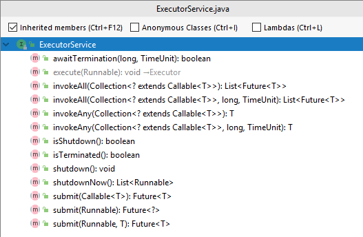
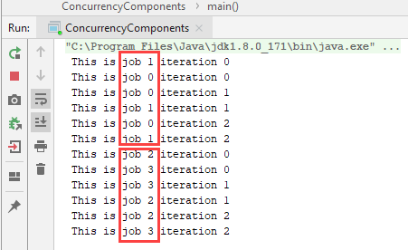

#  Concurrency

### Learning Objectives

*After this lesson, students will be able to:*

- 

### Lesson Guide

| TIMING  | TYPE  | TOPIC  |
|:-:|---|---|
| 5 min | Opening | Introduction  |
| 15 min | Instruction | Executor Class |
| 

## Introduction

#### Concurrency Components

Until Java 5 arrived on the scene, that was pretty much the extent of the concurrency support. You basically were given the low level functionality, but building things like thread pools (to dispatch pools of threads), or semaphores (like locks except with more than one permit), were left to the programmer. Soon after the advent of Java, Oswego Professor Doug Lea published his seminal book Concurrent Programming in Java, which introduced many design patterns to assist with the complexities of concurrency. Then in 2006, Brian Goetz (currently the Java Language Architect at Oracle) et.al. released Java Concurrecy in Practice, tightening up many of the original patterns, and introducing many more patterns and concurrency strategies. These were further streamlined by the Java Community Process.

Java 5 distilled all of that knowledge into the `java.util.concurrent` package, which provided a rich set of components for handling many important concurrency design patterns. We will go through the important ones now.

## Executors Class

So far we have seen how to create threads; but threads use resources, and it would be dangerous to have programs spin arbitrary numbers of threads. To control this, there is a concept of a _thread pool_. This is a component that allocates threads from a fixed pool, and once the pool is depleted, requests for more threads block, until threads are returned to the pool. 

In Java thread pools belong to the category of ExecutorServices, and are created using a factory class called _Executors_, which contains many static methods for creating different flavors of ExecutorService. Looking at the API for ExecutorService, there are methods for invoking, shutting down, and checking status.  



We will concentrate on construction, and the methods `execute`, and `submit`.

### Fixed Thread Pool

To construct a fixed thread pool, call `Executors.newFixedThreadPool(pool-size)`, passing in the number of threads to pool. For example:

```java
private final ExecutorService threadPool = Executors.newFixedThreadPool(3);
```

(We made the threadPool variable private because we want to prevent any other access to it except for our class, and final so that we don't dereference it.)

That returns a new ExecutorService, which in this example we assigned to a variable called _threadPool_.

To use that thread pool, we call the `ExecutorService.execute(Runnable)` method, providing a Runnable instance. This is usually done by supplying an anonymous inner class or Lambda expression. Here is how it looks:

<details>
<summary>Executor Service</summary>

```java
ExecutorService threadPool = Executors.newFixedThreadPool(2);
threadPool.execute(new Runnable() {
    @Override
    public void run() {
        for (int i = 0; i < 3; i++) {
            System.out.println(" This is thread 0" + " iteration " + i);
            try {
                Thread.sleep(1000);
            } catch (InterruptedException e) {
                Thread.currentThread().interrupt();
            }
        }
    }
});

```
</details>

We are creating a new `Runnable`, providing a `run()` method that iterates three times, printing out the thread number and the iteration number.

Let's see what happens if we start 4 threads like that. Since we hate copy and paste code, let's take a moment to do a bit of refactoring.

<details>
<summary>ExecutorService in action</summary>

<!-- code in com.generalassembly.concurrency.ConcurrencyComponents -->
```java
public static void main(String[] args) {
    ExecutorService threadPool = Executors.newFixedThreadPool(2);
    threadPool.execute(getRunnable(" This is job 0"));
    threadPool.execute(getRunnable(" This is job 1"));
    threadPool.execute(getRunnable(" This is job 2"));
    threadPool.execute(getRunnable(" This is job 3"));

}

private static Runnable getRunnable(String message) {
    return new Runnable() {
        @Override
        public void run() {
            for(int i = 0; i < 3; i++) {
                System.out.println(message + " iteration " + i);
                try {
                    Thread.sleep(1000);
                } catch (InterruptedException e) {
                    Thread.currentThread().interrupt();
                }
            }
        }
    };
}
```

<!-- COMMENT (Brandi): Can we put the example's output in here as well for folks who may simply be reading through the lesson?-->
<!-- (Victor) Done -->

</details>

Now, the pool only has two threads, but we are calling it four times. Looking at the output, we see that the first two jobs run until complete, whence the next two jobs run:  
)

## How Many Threads Should I Use?

How large should you make your thread pool? If each thread pinned the CPU (i.e. brought CPU utilization near 100%), then you would generally want no more than one thread per CPU. So the idea is to look at CPU utilization for one thread, and divide that number into the number of CPUs. For example, if we have 4 cores, and the utilization from one thread is 20% per core, then the number of threads for 100% utilization would be 4/.2 = 20. If you need to exceed that, then it's probably time to start thinking about upgrading hardware. But don't make rash decisions until you test things, because Java is clever about context switching and swapping, so it will still work albeit marginally slower.

## Cached Executor

We will briefly mention the cached executor. This is kind of an unlimited thread pool. You would only use this if you know you have a limited number of short lived threads, so there is no reason to limit it using a fixed thread pool. We will use this in some of our examples for simplicity, but in general there is probably more reason to use fixed thread pools.

The cached execute is created by calling

```java
ExecutorService executor = Executors.newCachedThreadPool()
```

One place you might want to use a cached thread pool would be for UI events. UI frameworks like Swing, or if you are building a Java-based web-browser dom, such cases will normally have a single event thread controlling all of its UI rendering, such as displaying mouse overs when hovering over buttons, or displaying typed keys on keyboard entry. You want to avoid using the event thread for anything else, and so whenever it needs to do some work that might cause it to delay, it should delegate to another thread. For such cases, a cached thread pool would be in order, because the threads are short lived, and you don't generally want to impose arbitrary limits on the number of them, because you want all of your rendering to happen quickly

<!-- COMMENT (Brandi): Can we add a more concrete example of a situation we'd want to use this? -->
<!-- how's this? -->

## Futures

A _Future_ in Java is a kind of promise, that data _will_ be available. So until it has that data, our thread waits and will block if you try to access it.

To get the result of a Future, call its `get()` method, which blocks until there is something _to get_!

When you call `ExecutorService.submit()` method, it returns a `Future`.
 
### Scheduled Executor

An important flavor of ExecutorService is the _scheduled executor_. This calls its job repeatedly at fixed intervals. For example, let's say we created a job that checks for files on an FTP server, and when files are there, it processes them. Let's say our requirement is to check every 1 minute.

<details>
<summary>Scheduled Executor</summary>

```java
private void checkFtpServer(long period) {
    ScheduledExecutorService scheduledExecutor = Executors.newScheduledThreadPool(1);
    scheduledExecutor.scheduleAtFixedRate(checkAndProcessFile(), 0, period, TimeUnit.SECONDS);
}

```
</details>

In this example, we are creating a new scheduled thread pool, which is a kind of `ScheduledExecutorService`, and then scheduling our job at a fixed rate of `period` seconds, with an initial delay of 0. That will check for files and process them every `period` seconds, which is a good alternative to the sleep approach we have been using until now.

## Atomics Components - AtomicInteger

Imagine you are creating a hit counter for a website. The naive implementation would say something like (in pseudocode):

```java
Line 1: value = getHitCounter();
Line 2: value = value + 1;
Line 3: setHitCounter(value);
```
Now that looks all well and good, except, what happens if two threads call this code using an inauspicious sequencing of events.

Let's say the hit counter is currently at 1000, when the two threads attack. Now follow me closely:

```text
Thread 1 calls Line 1, gets value of 1000
Thread 2 calls Line 1, gets value of 1000 (since Thread 1 has not set the value yet!)
Thread 1 calls Line 2, increments its counter value to 1001 
Thread 2 calls Line 2, increments its counter value to 1001 
Thread 1 sets the hit counter to 1001
Thread 2 sets the hit counter to 1001
```

What just happened?? We had two threads, and we only incremented the hit counter by one!!

Now one solution to this would be to combine Lines 1, 2, and 3 into a single call, and synchronize it. 

But Java provides those semantics inherently, in its AtomicInteger class.

Let's see an example:

<details>
<summary>AtomicInteger Example Code</summary>

```java
package com.generalassembly.concurrency;

import java.util.concurrent.ExecutorService;
import java.util.concurrent.Executors;
import java.util.concurrent.atomic.AtomicInteger;

public class AtomicIntegerLesson {
    private final ExecutorService executor = Executors.newCachedThreadPool();
    private final AtomicInteger hitCounter = new AtomicInteger(0);

    private void hit() {
        int value = hitCounter.incrementAndGet();
        System.out.println(value);
    }

    private void spinThread() {
        executor.execute(new Runnable() {
            @Override
            public void run() {
                for (int i = 0; i < 100; i++) {
                    AtomicIntegerLesson.this.hit();
                }
            }
        });
    }

    public static void main(String[] args) {
        AtomicIntegerLesson lesson = new AtomicIntegerLesson();
        lesson.launch(lesson);
    }

    private void launch(AtomicIntegerLesson atomicIntegerLesson) {
        for(int i = 0; i < 100; i++) {
            atomicIntegerLesson.spinThread();
        }
    }
}
```

<!-- COMMENT (Brandi): Can we add more explanations here? For example, definition of the word atomic, explanation of the lambda/arrow -> syntax. -->
<!-- I added some explanation of atomic earlier. Is that ok? -->
<!-- Regarding the use of the lambda - we should probably leave that until the lesson on Lambdas-I replaced it with an anonymous inner class -->

</details>

In this example, the hit counter starts at 0. We are launching 100 threads, having each one hit the thread counter 100 times. If all goes well, the hit counter should reach 10,000. If there is even a single race condition, we will never see 10,000.

Running that application yields the log output:

```text
1
6
8
9
5
11
3
...
9996
9997
9998
9999
10000

Process finished with exit code 0
```
The good news is we reached 10000!

Don't be thrown by the fact that some of the numbers appear out of sequence; that's just the way the output was ordered by the thrashing threads. If you study the output carefully, you will see there is exactly one of each number from 1 to 10,000. 

## ReadWriteLock

There are many more components in the `java.util.concurrent` package, each implementing some valuable concurrency design pattern. We will look at one more, but it pays to study the documentation to see the full treasury: https://docs.oracle.com/javase/8/docs/api/index.html?java/util/concurrent/package-summary.htm]

 The last concurrency component we will look at is the `ReadWriteLock`, which solves a common problem.
 
 Let's say you have many readers of a certain set of data. There are also writers that change the data, and the changes must be atomic, in the sense that we want to ensure that readers can't read the data until all of it is changed. What would be an example of that?
 
 Well, a very common example would be a stock portfolio owned by a hedge fund. There's money on the line, so we've got to get this right!
 
Let's say we have the following:
 
 |Ticker|# of Shares|Price|Total|
 |---|---|---|---|
 |FB	|10,000	|$176.00 	|$1,760,000.00  |
 |ABC	|5,000	|$98 	|$490,000.00    |
 |MSFT	|700	|$131.00 	|$91,700.00     |
 |	|	|Total 	|$2,341,700.00      |

Now the fund constantly trades shares, and prices constantly change. Let's say the fund updates the portfolio shares and prices every minute. 
  
Let's say they just sold 500 shares of FB at $176, and used the money to buy 1000 shares of ABC, an equivalent value. (Assume the price of each share did not change at all, only the number of shares.)
  
 So in reality, the value of the portfolio hs not changed at all; $98,000 of FB was sold, and the same amount of ABC was bought. Zero net change in portfolio value.
 
 But imagine that a reader came in to calculate the portfolio value just while the writer was updating.
 
 The writer sold the 176,000 of FB, and the reader comes in. The reader is a fast thread, so it reads FB (down 176,000), ABC (unchanged, because the writer did not get to it yet), and MSFT (which was not changed at all) So in that scenario, the reader will see a portfolio that is $176,000 lower than the actual value. Hmm... what should we do?
 
 Now, we might try to synchronize, which should cure the problem of data consistency, but by doing so, the writers may never get a chance to write, since there might *always* be readers holding the lock. Our hedge fund manager is not on board.
 
 The solution for both data consistency and a happy boss in this case is to use a `ReadWriteLock`.
 
 The way this works is each reader thread grabs a read lock. These do not block each other at all.
 
 When a writer gets a write lock, the writer blocks until there are no more readers! And no _new_ readers can get in, as long as a writer is waiting for a write lock.
 
 Here is an animation to illustrate that
 
 (The reader threads are shown with arrow heads, and the writers have trapezoid heads. Also, the state is color coded - green is running, and white is waiting.)
 
 

Notice in the animations, that as long as there are no writers, readers come and go freely.

As soon as a writer comes along, new readers and writers must wait.

Once the last writer does its job, all of the waiting readers are free once again to perform their computations.

To create a new `ReadWriteLock`, call exactly that:

```java
ReadWriteLock readWriteLock = new ReadWriteLock();
```

> Usage for reads: To grab a read lock, call `readWriteLock.readLock().lock()`, and to relinquish the read lock, call `readWriteLock.readLock().unlock()`.

> Usage for writes: To grab a write lock, call `readWriteLock.writeLock().lock()`, and to relinquish the write lock, call `readWriteLock.writeLock().unlock()`.

Let's look at an example, first without the read write lock, then again with.
Copy and paste the following into a single Java source file called _ReadWriteLockLesson_ in package _com.generalassembly.concurrency_.

<details>
<summary>ReadWriteLock</summary>

```java
package com.generalassembly.concurrency;

import java.util.*;
import java.util.concurrent.ConcurrentHashMap;
import java.util.concurrent.ExecutorService;
import java.util.concurrent.Executors;
import java.util.concurrent.locks.ReadWriteLock;
import java.util.concurrent.locks.ReentrantReadWriteLock;

/**
 * Holding class contains the ticker, shares, and prices of a stock in a portfolio
 */
class Holding {
    private String ticker;

    public int getShares() {
        return shares;
    }

    private int shares;

    public void setShares(int shares) {
        this.shares = shares;
    }

    public void setPrice(double price) {
        this.price = price;
    }

    private double price;

    public Holding(String ticker, int shares, double price) {
        this.ticker = ticker;
        this.shares = shares;
        this.price = price;
    }

    public double getPrice() {
        return price;
    }
}

public class ReadWriteLockLesson {
    private final List portfolio = new ArrayList();
    ExecutorService executor = Executors.newCachedThreadPool();

    public static void main(String[] args) {
        new ReadWriteLockLesson().launch();
    }

    // create our read write lock
//    ReadWriteLock readWriteLock = new ReentrantReadWriteLock(); // uncomment

    private void launch() {
        createPortfolio();
        for (int i = 0; i < 10; i++) {
            // create 10 reader threads, that continue without pause
            createReaderThread();
        }
        createWriterThread();
    }

    private void createReaderThread() {
        executor.execute(() -> read());
    }

    private Map<Double, Integer> values = new ConcurrentHashMap<>();

    private void read() {
        while (true) {
//            readWriteLock.readLock().lock(); //uncomment
            double value = 0;
            for (int i = 0; i < portfolio.size(); i++) {
                Holding holding = (Holding) portfolio.get(i);
                double holdingValue = holding.getShares() * holding.getPrice();
                value += holdingValue;
            }
            synchronized (ReadWriteLockLesson.class) {
                int size = values.size();
                values.put(value, 0);
                if (values.size() != size) {
                    // only save the value if it is changed. If the program works, there should only ever be one value
                    System.out.println(values);
                }
            }
//            readWriteLock.readLock().unlock(); // uncomment
        }
    }

    private void createWriterThread() {
        executor.execute(() -> write());
    }

    // for the fun, we will first sell FB and buy ABC, then we will buy FB and sell ABC
    volatile int plusMinus = 1;

    private void write() {
        while (true) {
//            readWriteLock.writeLock().lock(); // uncomment
            Holding fb = (Holding) portfolio.get(0);
            fb.setShares(fb.getShares() - plusMinus * 500);
            Holding abc = (Holding) portfolio.get(1);
            abc.setShares(abc.getShares() + plusMinus * 1000);
            plusMinus *= -1;
//            readWriteLock.writeLock().unlock(); // uncomment
            try {
                // sleep briefly to give readers a chance to read
                Thread.sleep(100);
            } catch (InterruptedException e) {
                Thread.currentThread().interrupt();
            }
        }
    }

    /**
     * Create a one time portfolio
     */
    private void createPortfolio() {
        portfolio.add(new Holding("FB", 10_000, 176.00));
        portfolio.add(new Holding("ABC", 5_000, 88.00));
        portfolio.add(new Holding("MSFT", 700, 131.00));
    }
}

```
</details>

That produces output:

```text
{2291700.0=0}
{2379700.0=0, 2291700.0=0}
{2379700.0=0, 2203700.0=0, 2291700.0=0}
```

So we see the portfolio has produced three different values, depending on the sequence of how they were called.

Now, search for the five lines marked `uncomment` and uncomment those line, which inserts the `ReadWriteLock` logic, and try again. (A great keyboard shortcut to learn that is used in IntelliJ as well as the other popular IDEs is `Ctrl-/`, which will comment a line, and if already commented, will uncomment it. Please try that.)

```text
{2291700.0=0}
```

Doing that, we see there is a single value, as we had hoped. 

## ConcurrentHashMap
You will notice that we used a new Map implementation, _ConcurrentHashMap_. This is very similar to a standard _HashMap_, except that it is designed to handle concurrency.

The main difference is that a standard HashMap prevents threads from iterating and writing at the same time, by throwing a ConcurrentModificationException. This is called _fail-fast_ and ensures that the data in the Map is the same throughout the iteration. In contrast, a ConcurrentHashMap assumes you will take care of any required locking externally, and so will not fail-fast when iterating and writing.

Generally if you have multiple threads iterating and writing to a Map, you want to use a ConcurrentHashMap instead of a HashMap.

## Summary

<!-- COMMENT (Brandi): Summary should be a little better. For now I just reiterated the lesson objectives, but maybe we include a brief how-to on how to know which tool to use when. A quiz maybe? -->

Wow, we learned a lot in this lesson! To recap, here's what we hope you can discuss:

  - Why use concurrency?
  - How to create a Thread: 2 Different Ways!
    - Extending Thread
    - Implement the Runnable interface
  - Estimate how many threads to use
  - Usage of the synchronized keyword
  - Locking and associated thread states
  - Signalling threads using wait/notify - synchronization
  - Concurrency components:
    - Executors and ThreadPools
    - Execute vs. Submit
    - Atomics components - AtomicInteger
    - ReadWriteLock

## Here are some topics for group discussion:

1. You are making a hit-counter for your website. You want to make sure that concurrent threads don't update the hit counter at the exact same time, messing up the count. Which concurrency component should you use? <!-- AtomicInteger -->
2. You are writing an inventory management system. Merchandise can arrive or ship out at any time. Your application must always be able to add up the inventory, but it must wait until updates are complete before calculating the value. Which concurrency component should you use? <!-- ReadWriteLock -->

3. You are building a file transfer application, and you have two threads - the first one has to ask the user for the FTP address, and the second one has to actually transfer the file. How can the first thread signal the second thread that the user has input the address and the transfer can begin? <!-- Second thread should call some mutex.wait(). First thread should call mutex.notify() when ready. Both threads should synchronize on the same mutex, which allows them to signal eachother -->
