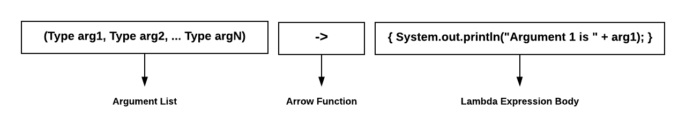

|                     Title                    |  Type  | Duration |  Creator |
|:-------------------------------------------:|:------:|:--------:|:--------:|
| Functional Programming - Lambda Expressions | lesson |   1:30   | Kyle Dye |


#  Functional Programming | Lambda Expressions

### LEARNING OBJECTIVES
*After this lesson, you will be able to:*
* See how lambda expressions and streams improve code readability
* See how lambda expressions significantly decrease the amount of code to accomplish a task
* Create a Lambda Expression with streams

### STUDENT PRE-WORK
*Before this lesson, you should already be able to:*
- Understand the Java Basics lessons
- Understand the OOP in Java lessons

### INSTRUCTOR PREP
*Before this lesson, instructors will need to:*
- Read through the lesson
- Add additional instructor notes as needed
- Edit language or examples to fit your ideas and teaching style
- Open, read, run, and edit (optional) the starter and solution code to ensure it's working and that you agree with how the code was written

---

### LESSON GUIDE

| TIMING |         TYPE         |                                           TOPIC                                          |
|:------:|:--------------------:|:----------------------------------------------------------------------------------------:|
|  5 min |        Opening       |                                 Discuss lesson objectives                                |
| 10 min |     Introduction     |                         Describe the syntax of lambda expressions                        |
| 10 min |         Demo         |   Using an interface to add 2 numbers - Show an example with and without using lambdas   |
| 10 min |     Introduction     |                          Streams and iterating collections and streams                         |
|  5 min |         Demo         |                      Example of using streams to create another collection                     |
| 10 min |     Introduction     |                         Discuss the different types of Collectors                        |
|  5 min |         Demo         |      Modify the previous Demo of creating another collection to leverage a collection Collector      |
| 10 min |     Introduction     |                                      Discuss filters                                     |
| 20 min | Independent Practice | Take what we've learned and complete a program using streams, lambda expressions, filtering, and collecting |
|  5 min |      Conclusion      |                                       Review/Recap                                       |

## Opening

## Introduction: Lambda Expression Syntax

# 

A Lambda expression is an anonymous function that provides a very concise and functional syntax, which is further used for writing anonymous methods. Lambda expressions are similar to anonymous classes, in that they enable you to express functionality as data, for example to pass functionality into a method as a parameter.  But where anonymous classes require a lot of boilerplate code to set up the class, lambda expressions provide a concise syntaxt specifically for expressing code as  data.

A lambda expression consists of the following:
- A comma-separated collection of formal parameters enclosed in parentheses.
- Followed by an arrow, ->
- Followed by the body, consisting of either a single expression or a statement block.

> You may, but are not required to, specify the data type of the parameters in a lambda expression, and where there is no ambiguity they are usually omitted for brevity.  

> In addition, you may omit the parentheses around the parameter list, providing there is exactly one parameter. 

> Finally, if the body consists of more than one statement, it must be enclosed in squiggly brackets. However if it consists of exactly one statement, the brackets may be omitted, in which case the "return" key word must also be omitted, and the semicolon at the end of the lambda must also be omitted.

**Example:**

    (int a, int b) -> { return a * b;}
The above example has 2 _int_ type parameters, "a" and "b" respectively.  The expression body will multiply the int parameter "a" with the int parameter "b".

In this example the type _int_ is usually optional (depending on context), and can be expressed as:  

    (a, b) -> { return a * b;}  
    
Since it is a one statement Lambda, we can also drop the brackets, return, and semicolon:

    (a, b) -> a * b  

<!-- todo: We should also include an example of a single parameter Lambda, omitting the parentheses: a-> System.out.println(a) - Victor-->
 
 <!-- todo: We should also include an example of a no-parameter Lambda, demoing the common idiom ()->lambda - Victor->

## Demo: To Lambda Or Not To Lambda, That Is The Question

In the following demo, we will create a "Computation" interface.  We will use this interface to solve simple math problems.
We will create 2 versions of the demo: Without Lambda Expressions and With Lambda Expressions.

**Example Without Lambda Expressions:**
    
    package com.ga.examples;
    
    public class NonLambdaExpressionIntroDemo {
    
        //Here's the Computation Interface
        interface Computation {
            int operation(int a, int b);
        }
    
        public static void main(String[] args) {
    
            //Notice the use of the anonymous inner class.
            Computation add = new Computation() {
    
                @Override
                public int operation(int a, int b) {
                    return a + b;
                }
            };
    
            System.out.println("5 + 6 = " + add.operation(5,6));
    
            //Notice the use of yet another anonymous inner class.
            Computation subtract = new Computation() {
    
                @Override
                public int operation(int a, int b) {
                    return a - b;
                }
            };
    
            System.out.println("10 - 6 = " + subtract.operation(10,6));
    
        }
    }

The output will be the following:
5 + 6 = 11
10 - 6 = 4

**Example WITH Lambda Expressions:**

    package com.ga.examples;
    
    public class LambdaExpressionIntroDemo {
    
        interface Computation {
            int operation(int a, int b);
        }
    
        public static void main(String[] args) {
    
            Computation add = (a, b) -> a + b;
    
            System.out.println("5 + 6 = " + add.operation(5,6));
    
            Computation subtract = (a, b) -> a - b;
    
            System.out.println("10 - 6 = " + subtract.operation(10,6));
        }
    }
    
**Note:** Notice the reduction of the amount of code needed to do the computation.  Stress this to the class!  

**Example 1:** 680 Characters and 32 lines  
**Example 2:** 416 Characters and 19 lines  

This is a 39% reduction in characters and 41% reduction in lines of code! Also, in most cases, code that uses Lambdas becomes more expressive and more readable.

## Introduction: Streams and Collections

**What is a Stream?**  
Where a _collection_ is a data structure that stores elements, a stream is a sequence of elements that moves values from a source, such as a collection, through a pipeline of steps.  Stream operations leverage Lambda expressions to produce a result, as we'll see shortly.

**What is a Pipeline?**  
A pipeline is a sequence of operations, such as filtering, modifying, or aggregating operations, that are applied to a source stream to produce a result. The result can be anything; a primitive, an object, a collection, or even another stream. The operations are supplied as parameters, expressed as lambda expressions.  Some of the common stream operations are _map_, _filter_, _sum_, _average_, _sort_, and _forEach_.

**Types of Stream Operations**  
Stream operations are used to modify streams to create an end result. Stream operations come in two major flavors:  
- _Intermediate operations_ take a stream as input, filtering and modifying the input elements to produce a new stream as output. Some of the commonly used intermediate operations are _map_, _filter_, _sort_, and _flatMap_. 
- _Terminal operations_ consume a stream to produce a final result. Once a terminal operation is reached, the stream is fully consumed, and no further operations can be applied to the stream. Some common terminal operations are _collect_, _reduce_, and _forEach_.

**Getting a Stream from a Collection**
Let's say we have the following list
```java
List<String> stringList = Arrays.asList("Hello", "World");
```
To generate a stream from the list we say:
```java
Stream stream = stringList.stream();
```

To print out the elements of the stringList collection using a stream, we could do the following:
```java
stringList.stream().forEach(stringValue -> {
    System.out.println(stringValue);
});
```

or even simpler:
```java
stringList.forEach(x -> System.out.println(x));
```

We can use the _forEach_ operator directly on the List, because Java Collections have a built-in _forEach()_ method, which implicitly calls _stream().forEach()_.

The output would be:  
Hello  
World

## Demo: Iterating a collection using streams

In this demo, we will take an existing list of String objects and iterate it to produce a new list of strings, consisting of the values from the original list concatenated with a constant string value.

<!-- todo: I did not check my syntax changes in the IDE; please double check -->
```java
package com.ga.examples;

import java.util.ArrayList;
import java.util.Arrays;
import java.util.List;

public class ListIterationWithConcatenationDemo {

    public static void main(String[] args) {
        // The original list
        List<String> stringList = Arrays.asList("My name is ", "My friends call me ", "My mother calls me ");
        List<String> concatenatedList = new ArrayList<>();

        stringList.forEach(stringValue -> concatenatedList.add(stringValue + "Jim");

        //Now output the values of the concatenatedList using streams.
        concatenatedList.forEach(stringValue -> System.out.println(stringValue) );

        //Now output the values of the original stringList using streams to show that the list is unaltered.
        stringList.forEach(stringValue -> System.out.println(stringValue) );
    }
}
```
    
The output would be:  
My name is Jim  
My friends call me Jim  
My mother calls me Jim  
My name is   
My friends call me   
My mother calls me   


**Key Takeaway**  
- Stress to the class the fact that the original list is unaltered when using streams.
- Have them identify the number of lambda expressions seen in the demo. Answer: 3

## Introduction: .map and .collect

**What does the map function do?**  
The map() intermediate operation is a method in the Stream class that represents a functional programming concept. In simple words, the map() is used to transform one object into a different object by using a lambda expression.

**Syntax:**  
.map(**argument -> function to apply) <-- Notice the lambda expression**

**Example:**  
    
    List<String> numbersList = Arrays.asList("1", "2", "3", "4", "5");
    
    Stream<Integer> numberListStream =
        numbersList.stream()
            .map(number -> Integer.valueOf(number) );

In the example above, we are iterating the list, and for each value, the "number" argument represents the next number in the list.  The function
"Integer.valueOf(number)" is applied to eachof those "number" values in-turn, producing a new stream of Integer values, that itself can
be further filtered, aggregated, and converted to other objects.

**Note:**  
The map() function will always return a stream since it's an intermediate operation.  

**What are collectors?**  
In the previous examples, we've seen how to iterate streams and how to map streams to new objects, to produce new streams. But at the end of the day, we want values not streams, so how do you come up with an end result? That's where collectors come in. 

Collectors are terminal operators that are used to implement various useful reduction operations, such as accumulating elements into collections, summarizing elements according to various criteria, etc. In short, collectors produce an end result from an input stream. 

Java provides a _Collectors_ class with many static methods. Let's zoom-in on one of those methods- "_toList()_", which we will use to expand our earlier example by consuming a stream of String objects representing integers, to produce a new list of corresponding Integers.

    List<String> numbersList = Arrays.asList("1", "2", "3", "4", "5");
    
    List<Integer> newNumbersList =
        numbersList.stream()
            .map(number -> Integer.valueOf(number))
            .collect(Collectors.toList());
 
 The _map_ operation converts each String from the input stream into an Integer, producing a new List of Integers.
 
 The _collect_ operation consumes that resulting Integer stream and produces a List of corresponding Integer objects.
 
 <!-- todo: we should talk about lazy execution of operators. I see this is mentioned in lesson 2 but not really explained. Victor -->

## Demo: Rewrite Previous Demo using Collectors
For this demo, we are going to revisit the "My name is Jim" demo above, this time using a Collector, instead of manually adding elements to a new list.

    package com.ga.examples;
    
    import java.util.ArrayList;
    import java.util.Arrays;
    import java.util.List;
    import java.util.stream.Collectors;
    
    public class MapWithConcatenationDemo {
    
        public static void main(String[] args) {
    
            List<String> stringList = Arrays.asList("My name is ", "My friends call me ", "My mother calls me ");
    
            List<String> concatenatedList =
                stringList.stream()
                    .map(stringValue -> stringValue + "Jim" )
                    .collect(Collectors.toList());
    
            //Now output the values of the concatenatedList using streams.
            concatenatedList.stream().forEach(stringValue -> System.out.println(stringValue) );
    
            //Now output the values of the original stringList using streams to show that the list is unaltered.
            stringList.stream().forEach(stringValue -> System.out.println(stringValue) );
        }
    }

The output would be:  
My name is Jim  
My friends call me Jim  
My mother calls me Jim  
My name is   
My friends call me   
My mother calls me   

**Instructor Note:**  
- Point out to the class that the code is more concise and readable by using collectors.
- Also point out the stream pipeline of stringList.stream(), map, and collect.

## Introduction: Filters
So far we discussed how streams can be manipulated via intermediate and terminal operations. We've seen how to use the intermediate operation "map" and the terminal operations "forEach" and "collect".  But what if we had a requirement where we only needed a subset of the data based on certain criteria?  This is where a very useful intermediate operation called "filter" comes in.

**What is a filter?**  
The filter method essentially selects a subset of elements from the original list based on a "Predicate" condition that is expressed as a Lambda. The _filter_ method accepts a Predicate object, which provides a function that is applied to a condition. We will see in the section on Functional Interfaces, that the Lambda is used to express the _Predicate_ functional interface, by taking an input value and producing a boolean. 
If the condition evaluates true, the object is selected. Otherwise, it is ignored.  

**Example:**

    List<Integer> numberList = Arrays.asList(1,2,3,4,5,6,7,8,9,10);
    
    //We want to create a list of only the even numbers.
    List<Integer> evenNumberList =
        numberList.stream()
            .filter(number -> number % 2 == 0)
            .collect(Collectors.toList());

    evenNumberList.forEach(number -> System.out.println(number));
    
In this example we use a Lambda expression in the filter method to express the condition "if the number is even, return true and keep it, otherwise return false and ignore it".
The output would be:  
2  
4  
6  
8  
10  

## Independent Practice
For the Independent Practice, we will take the following template program below and complete 
the "TODO" portions that are in the comments.  To confirm that your results are correct,
iterate each list that you create and output the results.  

**Hint:**  
- You'll need to leverage the intermediate operations "map" and "filter"
- You'll also need to use the terminal operation "Collectors.toList"

### Independent Practice Template

    package com.ga.examples;
    
    import java.util.Arrays;
    import java.util.List;
    
    public class IndependentPractice {
    
        static class Person {
    
            private String name;
            private int age;
    
            public Person(String name, int age) {
    
                this.name = name;
                this.age = age;
            }
    
            public String getName() {
                return name;
            }
    
            public void setName(String name) {
                this.name = name;
            }
    
            public int getAge() {
                return age;
            }
    
            public void setAge(int age) {
                this.age = age;
            }
            
            @Override
            public String toString() {
                return "Person{" +
                        "name='" + name + '\'' +
                        ", age=" + age +
                        '}';
            }
        }
    
        public static void main(String[] args) {
    
            List<Person> personList = createPersonList();
    
            //TODO: Create a List of Person Objects whose name starts with the letter M
    
            //TODO: Create a List of Strings containing the names of the Persons over the age of 40
    
            //TODO: Create a List of Person Objects whose name starts with the letter J and are under the age of 47
            
        }
    
        private static List<Person> createPersonList() {
    
            return Arrays.asList(
                new Person("Mark", 45),
                new Person("Henry", 30),
                new Person("John", 18),
                new Person("Morgan", 6),
                new Person("Amanda", 23),
                new Person("Tiffany", 60),
                new Person("Jim", 50),
                new Person("Janet", 45)
            );
        }
    }

The completed example can be found in the repo in the file named "IndependentPracticeCompleted.java".


## Conclusion
We've covered a lot in this brief introduction to lambda expressions, streams, filtering, and collecting. Hopefully this introduction shows how this _functional_ style can improve code readability and reduce the amount of code needed to achieve a task when compared to the classic _imperative_ style.

#### Let's Review

With a partner, draft a one sentence answer to each of these questions:
- What is a lambda expression?
- What makes lambdas great?
- What is a stream?
- What is filtering?
- What is collecting?

## References
- [Lambda Expressions Oracle](https://docs.oracle.com/javase/tutorial/java/javaOO/lambdaexpressions.html)
- [Java 8 Map, Filter, and Collect Examples](https://dzone.com/articles/how-to-use-map-filter-collect-of-stream-in-java-8)
- [Java API on Collectors](https://docs.oracle.com/javase/8/docs/api/java/util/stream/Collectors.html)
