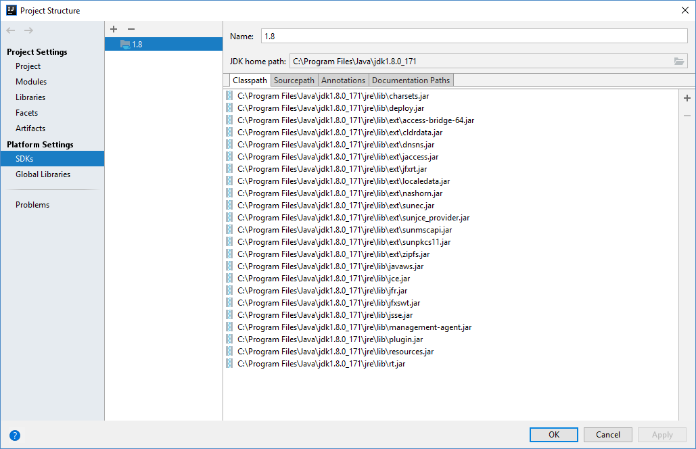
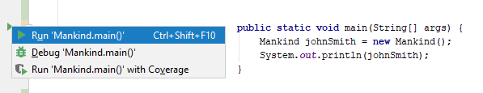
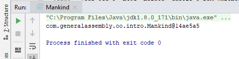
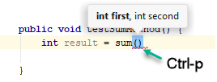
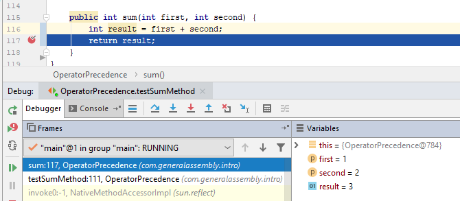
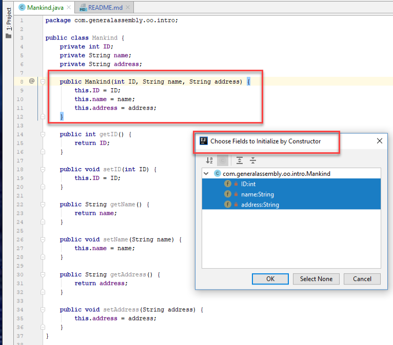
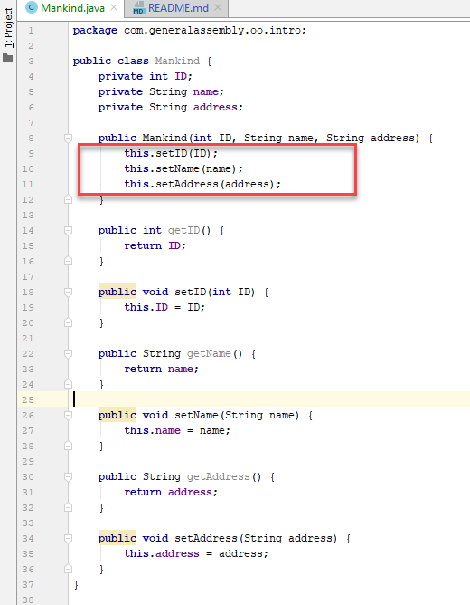

<!-- @Victor: this lesson is ~3200 words and needs to be reduced to ~1200 words to fit in the given time.
Please start by dentifying certain sub-sections from each lesson that can be removed - anything that’s slightly “advanced”, or that represents an edge case or special circumstance or nuance to the norm. If there are any parts of the lessons in which we explain several ways to do something, we can reduce that and just discuss the most common / easiest approach.
-->

# Objects

Students will be able to create an object from a class and use the object.

- Topics:
  - Variables
  - Methods
  - Constructors
  - Static methods
- Activities:
   - mankind activity (code along)
   - calculator activity (independent)
   Students will be able to define and implement the Singleton pattern.
      - Activity: create a Singleton.
- Sizing: 5 (biggest)

Note to instructor: Before you can execute Java code you must install a JDK (latest build of JDK 1.8).

Then you must assign that JDK to your IntelliJ Project The first time you try to execute the code, IntelliJ will prompt you for a JDK. Just point to the root directory of the JDK installation, on my machine that is: 



### Instantiating an object

<!-- 
This is a good reference. Please don't delete
Reference [this lesson](https://git.generalassemb.ly/ed-product-library/programming-fundamentals-in-java/tree/master/baseline-materials/classes-lesson) or [this lab](https://git.generalassemb.ly/ed-product-library/programming-fundamentals-in-java/tree/master/baseline-materials/classes-pair-programming-lab) for ideas.
I added an assignment below, the Calculator class
-->

In OOP a class is a kind of template for creating _Objects_. An Object is an _instance_ of a class; it contains all of the data fields and functionality defined in its class, although each object can contain its own set of values for those fields. For example, a class might define a _name_ field of type String, but individual instances of that class might have unique values assigned to that name field, "Joe", "Mary", "Alice". 

Think of it as follows:
We know 'Mankind' is a classification of creature that thinks, has senses, a body, etc. But we don't think of a person as a 'Mankind'; mankind is the class; John Smith is an _instance_ of mankind. He has a name, blue eyes, two ears, legs, etc. 

Let's make this more concrete. Let's create a class called Mankind. For now, we will just create a shell of the class, and we can add to it as we go, so please follow along with me.

Step 1. First, create the file to contain the public _Mankind_ class. Who can tell me the name of that file? Good - Mankind.java. Note that IntelliJ will hide the .java, and just display the class name.

Remember we must create it in a directory that mimics the package name, i.e. src/com/generaassembly/oop/intro/Mankind.java:

```java
package com.generalassembly.oop.intro;

public class Mankind {
    
}
```
Step 2. Next, let's add a _main_ method so we can execute our code (remember a main method defines the entry point of a program):

(If you hate typing, IntelliJ has a convenient shortcut for defining a main method... just type _psvm_ and hit the tab key; that stands for "public static void main". That is an example of an IntelliJ _live template_. Getting familiar with these will make you a speed programmer!)

```java
package com.generalassembly.oop.intro;

public class Mankind {
    public static void main(String... args) {
        
    }
}
```

Now we have defined our Mankind class. But classes are not much good until they are _instantiated_.

Step 3. To create an instance of the Mankind class, you need to call the Mankind _constructor_. This is done using the _new_ keyword. Let's add that instance creation to our _main_ method, then print out our instance, as follows:
```java
public static void main(String... args) {
    Mankind johnSmith = new Mankind();    
    System.out.println(johnSmith);
}
```

Voila! We have a new instance of a Mankind!

Let's analyze that:
```Mankind johnSmith ``` means declare a variable of type 'Mankind' and name the variable johnSmith. (Remember the Java naming convention - camel case variable names, classes start with a capital, variables start with a lower case letter.)

The = sign means assign everything on the right of the equal sign, to the variable on the left.

``` new Mankind() ``` is called a 'constructor' and it means _construct_ (create) a new instance of the Mankind class (i.e. using the Mankind class as a template). This process is known as instantiation; we are 'instantiating' a new object, i.e. creating a new instance, of the Mankind class.

So in summary, the statement
```java
Mankind johnSmith = new Mankind();
```

means declare a new variable named "johnSmith" of type "Mankind", and assign it a new instance of the class Mankind. 

<!-- todo: move this to the lesson on visibility, and be careful to move the instantiation outside the main method and into the class, or else it is a compile error to declare a visibility.

In this example we omitted the visibility, implying default visibility, which as we said means that it is only visible to classes in the same package. More commonly we will make instance variables private, by prefacing the declaration with the word _private_, as follows:
```java
private Mankind johnSmith = new Mankind(); // this is only visible in this class file
```
(We could also assign public visibility to make this instance available to all objects outside this class, or protected to make it available to subclasses. Move on subclasses later.)

(Don't be confused with my earlier statement, when I said that top level classes can only be public or default. That is true about the class declarations themselves, i.e. when we say ```public class SomeClass``` or ```class SomeClass```. But variables referring to those classes can be any visibility.

Just to be clear, it is a compile error to try to declare the following as a top level class:
```java
private class InvalidClass{}
```
but it is perfectly valid to say
```java
private MyValidClass someVariable;
```

--> 

Finally, to run our program in IntelliJ, notice the little green arrow in the margin, to the left of our _main_ method. 


Give that arrow a left-click, then click on "Run Mankind.main"

That will compile and execute our code, and produce output something like:


### Exercise - Automobile
Now let's apply what we learned, and create a new class called Automobile in package `com.generalassembly.oop.intro`. Then add a _main_ method, create a new Automobile instance, and print it out. Then run your program.

### Members
So far we have seen how to define the shell of the class. But the value starts to be realized when we add _members_ to the class; fields, methods, and inner classes. We will look at fields and methods now, inner classes are a little more advanced, and you can Google to learn move about them.
<!-- Melissa is it ok to say it like this, about googling for more info? 
  @Victor - yes, absolutely fine to encourage this behavior.-->

#### Fields
Fields are the variables associated with every instance of this class. Methods, as we saw, provide the functionality to the class. (Or rather, to the objects instantiated from this class.)

#### Instance variables
Most fields are called _instance_ variables, because they are contained within an instance of the object. Two different object instances of the same class type might have completely different values for their instance variables.

For example, if our Mankind class has an _age_ field, then johnSmith.age might be 25, where maryJones.age might be 32.

(Now, how neat is that syntax: `johnSmith.age` means "the age field of the object referred to by the johnSmith variable". Nice, huh?)

Another fancy name for an instance variables that you will encounter is a "property". A property is basically an instance field with a getter and setter. A read only property only has a getter but no setter.

There is one rule you want to remember starting from today - you will almost always want to make fields in a class private, and then provide _accessor_ ("getter") and _mutator_ ("setter") methods for those fields. This is called encapsulation - it means that you never expose the structure of a class to anything outside the class; anyone accessing the class has to go through your exposed API (Application Program Interface). These are the methods that you expose to external classes by assigning a visibility like _public_. 

#### Class variables
Not all fields are instance variables. If a field is declared _static_, then they are called _class_ variables. A class variable shares its value among all instances of that class. If it changes for one instance, it changes for all instances. We will see examples of this shortly, and we will see why this is useful.

You will frequently hear the fields of an object referred to as its _state_. State essentially describes this object, and defines what distinguishes this object from any other object of the same class.

#### Methods
Methods provide the functionality associated with a class. 
Here is an example of a method declaration:
```java
public double sum(double first, double second) {
    
}
```
We will see how to code the implementation in a minute, but first let's study that structure.

As with any class member, we start the method declaration with the visibility, in this case public.

Next, we declare the return type. In this case, we are adding two doubles, so as we saw in our lesson on Java arithmetic, double plus double equals double, and we declare the result to be a double.

Some methods return nothing at all, say for example, a print method, or a method that writes to a database and does not need to return anything. There are many cases of such methods. To express a method that does not return anything, use _void_ as the return type.

```java
public void writeToDatabase(DBConnection conn, String data) {
    
}
```
This defines a method called _writeToDatabase_ that takes two input parameters, and returns nothing.

Finally, we enclose the arguments in parentheses - those represent the values that one must supply when they call the method.

We refer to the method name and arguments collectively as the _method signature_.

To call a method, specify the method name, followed by parentheses, and inside the parentheses enclose the values represented by the arguments in the method declaration. If there is a return value, you can (and generally should), assign that return value to a variable, or use it in an expression. Otherwise it is lost.

For example, in our _sum_ example above, you could say
```java
double result = sum(2, 4);
```

<!-- 
Melissa - The following paragraph beginning with 'Some languages such as JavaScript ' explains a curiousity if the student has exposure to any other programming languages at all, since Java works a little differently than most. If you think we shoud omit this please delete it.
@Victor students start the course with JS so I think it's valid to recognize the difference between the 2 languages - so we can include this.
-->
Some languages such as JavaScript allow you to omit arguments from a method call, and will either substitute a null or a default value for the omitted value. Java currently does not support that; the arguments of every method call in Java must exactly match the method it is calling. We will see why this is so when we cover method overloading later in the lesson.

In IntelliJ, if you don't remember the names of the parameters for a particular method, type the method where you want to use it, put your cursor between the parentheses and hit Ctrl-p. This will show a neat display of the parameters and types.

<table><tr><td>


</td></tr></table>
That's essentially the structure of every method declaration. But it's not very useful until we supply an implementation.

Like fields, methods can be static or not. Non-static methods are known as _instance methods_. Static methods are also known as _class methods_. We will cover statics in more detail later. 

A method implementation goes inside the opening and closing squiggly brackets following the method declaration. 

The implementation of an instance method has access to every field and method declared in the class, no matter what the visibility. It can also create its own variables, but these are lost once the method returns.

Let's try implementing our sum method:
(Instructor led)

```java
public double sum(double first, double second) {
    double result = first + second;
    return result;
}
```

Let's analyze that implementation.
``` double result = first + second;``` says declare a _method_ variable called result (we can name it anything we like, following the usual naming rules; letters, numbers, underscores, must not begin with a number) - try to use meaningful names and avoid abbrevations unless they are obvious. 

`double result = first + second` is far more expressive than
`double r=f+s` 
And nowadays memory is cheap but programmers are not (that's why we make the big bucks!), so you want to make your code easy to read and understand for the next guy (or yourself, in a week, when you have forgotten why you did what you did!) 

`return result;` says return the value of the variable called resultas the return value of this method.

Methods that return void can have (but do not require) a return statement, whereas non-void methods _must_ have at least one return statement.

We did not need to explictly declare the result variable above. The following is perfectly valid, and is called "inlining" the calculation (using the value _in-line_ without assigning it to a variable.)

```java
public double sum(double first, double second) {
    return first + second;
}
```

Inlining might save a step, but when you are analyzing your code in a debugger, having the intermediate variable helps with the debugging, because you can easily see the intermediate values. 
<table><tr><td>


</td></tr></table>

(You might think that although it's helpful to introduce an extra variable there, but doesn't that take a tiny amount of execution time, which might be significant in a low latency application? The truth is that extra step takes no execution time at all, because the Java "JIT" (Just-In-Time) compiler will inline that call for you. JIT is an optimizer built into the Java runtime, that analyzes your code during execution, and actually optimizes the code for performance while it is running. We won't be covering the JIT in this course, but I recommend Googling Java JIT compiler for more information.


### Static methods
Most of the methods and fields we have defined so far have been _instance_ methods; methods that require an instance to invoke.

However Java also provides _static_ (aka _class_) methods, that don't require an instance, they just execute on a class.

This is useful for defining behavior that does not necessarily belong to an instance, but just supplies some kind of common functionality or behavior.

Some common examples of static methods are the methods in the Math class, as we saw in the lesson on Java basics. Since the methods in Math are static, we don't need an instance of the Math class to call things like its _pow()_ or _max()_ methods, to get a power or the maximum of two values.

Static methods are defined exactly like instance methods, except they have the word 'static' before the return type. Static methods only have access to the static fields and methods in this class, as well as to any other values it creates or otherwise obtains externally. 

```java
int a = 4;
int b = 2;
System.out.println(a + "**" + b + "=" + (Math.pow(a, b))); // displays 4**2=16.0 (Java has no exp operator, so we invent ** just for display purposes)
System.out.println("max(a" + "," + b + ")=" + (Math.max(a, b))); // displays max(a,2)=4
System.out.println("min(a" + "," + b + ")=" + (Math.min(a, b))); // displays min(a,2)=2

``` 
If a method does not access any of the instance fields or methods from the class that it is defined in, consider making it static.

### Exercise - Calculator
We have covered a lot of ground, so let's do an exercise.

Let's create a class called Calculator, and add the sum method. Then add a main method to perform the following sums and print out the result:
```java
10 + 20
3.14 + 2.718
1.414+3.14
```
Hint: remember to instantiate a new Calculator before you start calling its methods. Then try making the methods static, and change the invocation accordingly.

<!-- @Victor, I collapsed the solutions here
-->

<details>
  <summary>Solution 1:</summary>
  
```java
package com.generalassembly.oop.intro;
public class Calculator {
    public double sum(double first, double second) {
        double sum = first + second;
        return sum;
    }
    public static void main(String[] args) {
        Calculator calculator = new Calculator();
        System.out.println(calculator.sum(10 , 20));
        System.out.println(calculator.sum(3.14 , 2.718));
        System.out.println(calculator.sum(1.414,3.14));
    }
}
```

</details>  

<details>
  <summary>Solution 2 (using static):</summary>
  
```java
package com.generalassembly.oop.intro;
public class Calculator {
    public static double sum(double first, double second) {
        double sum = first + second;
        return sum;
    }
    public static void main(String[] args) {
        Calculator calculator = new Calculator();
        System.out.println(sum(10 , 20));
        System.out.println(sum(3.14 , 2.718));
        System.out.println(sum(1.414,3.14));
    }
}
```

</details>  

A common idiom you are sure to encounter is when a method parameter has the same name as an instance variable.

For example, let's say you have the following class:
```java
class Person {
    private float age;
    public void setAge(float age) {
        
    }
}
```

Now there are two different variables with the same name _age_; the instance variable `private float age` and the method argument float age.

That is all well and good, and the class will compile with no objections.
But let's say you want to assign the value of the method variable to the class variable.
If you say:
```java
    private float age;
    public void setAge(float age) {
        age=age;   
    }
```
that is a no-op - nothing changes at all - it just assigns the value of the method's _age_ variable to itself.
What you really want is
```java
    private float age;
    public void setAge(float age) {
        this.age=age;   
    }
```

When you prepend a variable with the word _this._ you are making it eminently clear that you are referring to the instance variable and not the method variable. Some developers will always refer to instance variables using _this._ (even when it is optional), just because it makes it clear that you are referring to a class variable.

### Constructors
Very often, it will be convenient to pass some data into a new class after construction.
For example, let's resume our discussion of the  Mankind class, and suppose we want to add some fields, and some getters and setters:
```java
public class Mankind {
    private int ID;
    private String name;
    private String address;

    public int getID() {
        return ID;
    }

    public void setID(int ID) {
        this.ID = ID;
    }

    public String getName() {
        return name;
    }

    public void setName(String name) {
        this.name = name;
    }

    public String getAddress() {
        return address;
    }

    public void setAddress(String address) {
        this.address = address;
    }
}
```

Now, since all members of our class with have an ID, name, and address, we might do the following for each member of Mankind:
```java
Mankind johnSmith = new Mankind();
johnSmith.setID(123);
johnSmith.setName("Smith, John");
johnSmith.setAddress("123 Main St, Burbank, CA");

Mankind maryJones = new Mankind();
maryJones.setID(456);
maryJones.setName("Jones, Mary");
maryJones.setAddress("456 Elm St, New York, NY");
```

Now, that's a lot of lines to repeat for each operation. Java provides a shorthand, called the class "constructor".
A constructor looks like any other method, containing a visibility and parameters inside parentheses. However there are two differences between a constructor and any other method:
1. A constructor must exactly match the class name it is contained in.
2. A constructor has no return type.
3. (One more actually - a constructor may not be static)

Let's add a constructor to our Mankind class:

You actually don't have to type anything to add a constructor, if you use IntelliJ's keyboard shortcut: Alt-Ins, and select the fields you would like to assign, the constructor is added for you:
<table><tr><td>


</td></tr></table>

The constructor can also call methods within the class itself. In the following example, we are _encapsulating_ the fields by setting them using setters, rather than setting them directly.

<table><tr><td>


</td></tr></table>


Compare the constructors in the two previous examples closely, to understand the difference.

So given the constructor, we can now save a few lines of code (and make it clearer along the way) by entering:
```java
Mankind johnSmith = new Mankind(123, "Smith, John", "123 Main St, Burbank, CA");
Mankind maryJones = new Mankind(456, "Jones, Mary", "456 Elm St, New York, NY");
```

Like any method, a constructor call must contain all of the arguments, and no more than those arguments, and the order must be exactly as defined in the constructor.

### Default Constructor
Truthfully, even if you do not define a constructor for a class, Java supplies one implicitly.

To verify that, let's comment out the constructor, compile, and then display the decompiled class using the _javap_ decompiler utility we saw earlier:
<pre>
C:\dev\foundational-java>javap target\production\foundational-java\com\generalassembly\oop\intro\Mankind.class
Compiled from "Mankind.java"
public class com.generalassembly.oop.intro.Mankind {
  <b>public com.generalassembly.oop.intro.Mankind();</b> // DEFAULT CONSTRUCTOR WAS SUPPLIED!
  public int getID();
  public void setID(int);
  public java.lang.String getName();
  public void setName(java.lang.String);
  public java.lang.String getAddress();
  public void setAddress(java.lang.String);
</pre>
So we see that every class has at least one constructor.

Once you define your own constructor, Java _will no longer_ supply a default constructor, so if you want one, you would have to define it explicitly.

### Multiple Constructors

A class may have multiple constructors, as long as each has a signature that is distinct from the other constructors in the class.

For example, these two constructors would be legal, (albeit not very useful, since they both have the same arguments, just in a different order.):
```java
    public Mankind(int ID, String name, String address) {
        this.setID(ID);
        this.setName(name);
        this.setAddress(address);
    }

    public Mankind(String name, int ID, String address) {
        this.setID(ID);
        this.setName(name);
        this.setAddress(address);
    }

```

Since it is clear which constructor you are referring to, depending on whether you supply _new Mankind(int, String, String)_ or _new Mankind(String, int, String)_

However the following would not be legal
```java
    public Mankind(int ID, String name, String address) {
        this.setID(ID);
        this.setName(name);
        this.setAddress(address);
    }

    public Mankind(int ID, String address, String name) {
        this.setID(ID);
        this.setName(name);
        this.setAddress(address);
    }

```
since in that case, both methods have a common signature, _new Mankind(int, String, String)_, and so the Java compiler would not know which one you'd be referring to, and cannot resolve the ambiguity.

### Constructors Calling Constructors
It is a good practice to chain constuctor calls, so that every constructor calls another constructor. Using this pattern you can simulate constructors with default parameters. 
Use the `this()` constructor to call one constructor from inside another constructor.
For example:

```java
    public Mankind(int ID) {
        this.ID = ID;
    }

    public Mankind(int ID, String name) {
        this(ID);
        this.name = name;
    }

    public Mankind(int ID, String name, String address) {
        this(ID, name);
        this.address = address;
    }

```
 If a constructor This calls _this()_, that must be the first call inside a constructor.
 ```java
    public Mankind(int ID, String name, String address) {
        this.address = address;
        this(ID, name); // WON'T COMPILE. this() cannot follow any other code inside a constructor!!
    }

```
<!-- @Victor - this is something we could remove and cover in the Design Patterns lesson (a separate lesson) or on interview prep day -->

### Exercise - Instructor led - Singleton class
There is a common design pattern called _the Singleton_ class. This is a class that we want to ensure will ever only have one instance.

To create a singleton, we must make the constructor private, which means that only the class itself can call its constructor.

We make sure that the class creates one instance of itself, and provide a static accessor to that instance. If you want an instance, the only way to get it is to call the static accessor on the class name. And every call to that accessor always returns the same instance.

Let's create a singleton class called Logger, that has one method, called `public void info(String message)` whose only function is to print the message to System.out.

```java
package com.generalassembly.oop;

public class Logger {
    private static Logger logger = new Logger();

    private Logger() {
    }

    public static Logger getInstance() {
        return logger;
    }

    public void info(String message) {
        System.out.println(message);
    }
}
```
