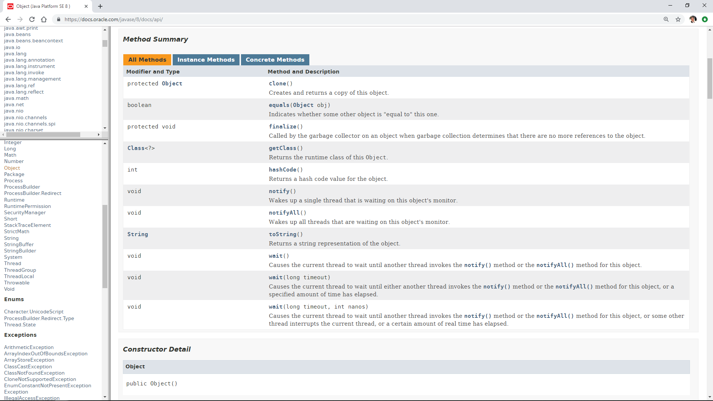

# Subclasses

Students will be able to create a subclass and use it to augment the functionality of the base class.
 
- Topics:
   - The Object class
   - Upcasting
   - Downcasting
   - Overriding methods
   - Visibility
   - Inheritance
   - Encapsulation
   - Polymorphism
- Activities:
   - Shape calculator
- Sizing: 3 (medium)

<!--
Additional materials to structure this section: 
- [lesson (with short practice section)](https://git.generalassemb.ly/ed-product-library/programming-fundamentals-in-java/tree/master/baseline-materials/subclassing-lesson)
- [lab](https://git.generalassemb.ly/ed-product-library/programming-fundamentals-in-java/tree/master/baseline-materials/subclassing-lab
-->


<!-- taken from https://odditymall.com/includes/content/thumb1366252920.png -->
In our use of language and observations from the world, we naturally categorize objects of similar types. We understand what a Cat is. We understand that a Lion is a member of the Cat family, and although we have no confusion between a cat and a line, we know that Lions share qualities with Cats.

We can say that Lion is a subclasses of Cat, and will inherit basic properties and functionality from its _superclass_ (its parent class).

Given the following definition of our Cat class:  

(Instructor should code this for the class)

```java
public class Cat {
    private String name;
    public String getName() {
        return name;
    }

    public void setName(String name) {
        this.name = name;
    }

    public boolean hasWhiskers() {
        return true;
    }

    protected String favoriteSnack() {
        return "Mice";
    }

    public int getLives() {
        return 9;
    }
}
```

we create a subclass by using the _extends_ keyword, as follows:
````java
class Lion extends Cat {
    @Override
    public int getLives() {
        return 1;
    }
}
````
In this case, we say Lion _extends_ Cat, or Lion is a _subcass_ of Cat. And we say Cat is a _superclass_ of Lion. 

The Lion class inherits member from it's superclass, so the following calls are legal, even though they are not in the Lion class, they are inherited from the Cat class:
```java
Lion lion = new Lion();
lion.hasWhiskers(); 
lion.favoriteSnack(); 
lion.getLives(); 
```
hasWhiskers() returns true - inherited from the Cat class
favoriteSnack() returns "mice" - inherited from the Cat class
getLives() returns 1, since a cat may have nine lives, but a Lion was not so endowed, because its getLives() method was _overridden_.

A subclass will inherit every field and method that it can see, i.e., every public member, protected member, (and default members, provided they are in the same package.) Private members cannot be inherited, except by classes defined in the same file.
 
It is a good idea to annotate an overridden method by placing the _@Override_ annotation above the method. Doing so instructs the compiler to ensure that you are overriding a method from the base class. Although this is not required, it is a good defensive practice, because in the future, if the base method happens to get renamed along the way, the code will fail to compile, (since it is no longer overridden), which will help with early detection of some subtle bugs that would result from your believing you were calling an overridden method but actually was a new method!

There are times that you want to ensure that your class cannot be subclassed. In such cases, you can declare your class to be _final_. If you try to subclass a final class, the compiler will warn you with a message like:
```java
Error: java: cannot inherit from final class
``` 

A subclass can override any member that is visible to it, except if the method is final or static, simply by defining the method using the exact same name and method signature as the base method it is overriding.

### The Object class
There is one detail that the Java class definition hides from you, and that is that every class ultimately inherits from the primordial Java _Object_ class. Object is the superclass of all other classes in Java.

Let's look at the structure of the Object class:



### Upcasting
Now, there is a subtle feature going on here, that is leveraged in just about every Java library you will use.
You can declare a variable to be of a certain type, and assign it any subtype. For example
````java
Cat cat = new Lion();
````

Now if you call ```cat.getLives()```, what do you expect will be returned - the 9 lives of the Cat, or the 1 of the Lion?

(Discuss this with the class -  there will be opinions on both sides) 

The rule to remember is that when you call a method on a variable, you are really calling the method on the instance contained in that variable.
So in our case, since the cat variable contains a Lion instance, the ```getLives()``` method will return the 1 life of the Lion and not the 9 of the parent Cat.
This is generally a good thing, because library vendors can now define subclasses of things, and they will function as the vendor intends them to. For example, JDBC libraries, which provide access to every brand of relational database, can override the particulars to make their libraries work, as long as they follow the pattern (the API) of the provided interfaces.  

### Downcasting
That's upcasting. Downcasting works as well, as long as you are casting to the correct Object type.

So I can say ``` Cat cat = new Lion()``` which as we saw above works fine since  Lion _is a_ Cat; but we cannot say ```Lion lion = new Cat()```, since  in general Cat's are not Lions.

However given the assignment ``` Cat cat = new Lion()```, we know that the Cat variable contains a Lion instance, therefore we should be able to assign it:
````java
Cat cat = new Lion();
Lion lion = cat;
````
However that fails to compile, because the compiler has no way to be sure that by the time the cat is assigned, it still contains a Lion instance.
To make that assignment, you must explicitly downcast it, using the _cast_ operator, as follows:
```java
Lion lion = (Lion)cat;
```
By preceding the variable cat with (Lion), you are _casting_ the cat instance to a Lion class, which is your way of signing a pact with the compiler, that you guarantee that the variable will contain a Lion instance.
And if you break that pact, as follows,
```java
    public static void main(String[] args) {
        Cat cat = new Cat();
        Lion lion = (Lion) cat;
    }

```
you will get a ClassCastException from the compiler:

### Visibility of overridden methods
An overridden method can be of the same visibility as the method it is overriding, or it can be more public. However it cannot be more private.

### Fields go by the variable not the instance
One surprising fact (that you don't want to get wrong in an interview), is that fields do not work the same way!
Field accesses go by the variable type, not the instance type.

### Encapsulation
Combining subcassing and visibility, we can hide the gory details of functionality inside a class, and just expose an API (Application Program Interface).

### Polymorphism
Polymorphism is a frightening sounding word, and you will hear it a lot, but it is really a very simple concept (although very profound, Grasshopper!)

Polymorphism simply means what we have been describing so far, that you can create various instances subclasses of the same class, and implement specific functionality for each.

### Exercise - Shapes
Let's say we have a class called Shape, as follows:
```java
package com.generalassembly.oop;

public class Shape {
    public double getCircumference() {
        return 0;
    }

    public double getArea() {
        return 0;
    }
}
```
Our Shape class has methods getCircumference and getArea, that depending on the shape, will calculate the circumference and area of the shape.

We can define a subclass of Shape called Triangle, that takes three sides in its constructor:
```java
package com.generalassembly.oop;

public class Triangle extends Shape{
    private double side1;
    private double side2;
    private double side3;

    public Triangle(double side1, double side2, double side3) {
        this.side1 = side1;
        this.side2 = side2;
        this.side3 = side3;
    }
}
```

Your assignment is to implement the getCircumference and getArea methods.

The circumference, or perimeter, is defined as the length of the outline of the shape, so for a triangle or rectangle, it is the sum of the sides, and for a circle, it is 2πr where _r_ is the radius, and π is Math.PI.

The area is the square footage covered by the shape.
 For a triangle, we can use Heron's formula:
 √(p(p−a)*(p−b)*(p−c))    
 where p = (a+b+c)/2.
 
 To take a square root, use the Math.sqrt() method:
 
 <details>
 
 <summary>Solution:</summary>
 
 ```java
package com.generalassembly.oop;

public class Triangle extends Shape{
    private double side1;
    private double side2;
    private double side3;

    public Triangle(double side1, double side2, double side3) {
        this.side1 = side1;
        this.side2 = side2;
        this.side3 = side3;
    }

    @Override
    public double getCircumference() {
        return side1 + side2 + side3;
    }

    @Override
    public double getArea() {
        double circumference = getCircumference();
        double p = circumference/2;
        double squared = p * (p-side1) * (p-side2) * (p-side3);
        double area = Math.sqrt(squared);
        return area;
    }
}
```

</details>

Now do the same for Circle and Rectangle. Remember these should all _extend Shape_.

```java
package com.generalassembly.oop;

public class Circle extends Shape{
    private double radius;

    public Circle(double radius) {
        this.radius = radius;
    }

    @Override
    public double getCircumference() {
        return 2 * Math.PI * radius;
    }

    @Override
    public double getArea() {
        return Math.PI * radius * radius;
    }
}
```
package com.generalassembly.oop;

public class Rectangle extends Shape{
    private int length;
    private int height;

    public Rectangle(int length, int height) {
        this.length = length;
        this.height = height;
    }

    @Override
    public double getCircumference() {
        return 2*length + 2*height;
    }

    @Override
    public double getArea() {
        return length *height;
    }
}

Now, let's say we want to create a Square shape. We remember from Geometry class, that a Square is a special kind of rectangle, where all sides are equal. For our next assignment, we will create a Square class that extends Rectangle, and instead of overriding the getCircumference and getArea methods, just provide a constructor that will pass in the same value for all sides into the rectangle constructor. 

### Exercise - Instruct Lead - Create Square Class
(Instructor - Ask for suggestions before implementing)

<details>
 <summary>Solution:</summary>

```java

public class Square extends Rectangle {
    public Square(int side) {
        super(side, side);
    }
}
```

</details>

Now this Square will automatically calculate its circumference and area.

And finally, let's calculate the circumference and area for each of the following 4 shapes:
* A triangle with sides 3, 4, 5
* A rectangle with length = 4 and height = 5
* A circle with radius = 4
* A Square with side = 4

Assign each one of these shapes to a variable of the appropriate type, and then pass that shape to a method with signature 
```    private static String getCircumferenceAndArea(Shape shape) ```
That will return a String consisting of "circumference, area = 12, 6", with the correct values for each shape.

<details>
 <summary>Solution:</summary>

```java
package com.generalassembly.oop;

public class ShapeCalc {
    public static void main(String[] args) {
        Triangle triangle = new Triangle(3, 4, 5);
        Rectangle rectangle = new Rectangle(4, 5);
        Circle circle = new Circle(4);
        Square square = new Square(4);

        System.out.println("Triangle " + getCircumferenceAndArea(triangle));
        System.out.println("Rectangle " + getCircumferenceAndArea(rectangle));
        System.out.println("Circle " + getCircumferenceAndArea(circle));
        System.out.println("Square " + getCircumferenceAndArea(square));
    }

    private static String getCircumferenceAndArea(Shape shape) {
        String rval = "circumference, area = " + shape.getCircumference() + ", " + shape.getArea();
        return rval;
    }
}

```

</details>

Output:
```java
Triangle circumference, area = 12.0, 6.0
Rectangle circumference, area = 18.0, 20.0
Circle circumference, area = 25.132741228718345, 50.26548245743669
Square circumference, area = 16.0, 16.0
```

The important thing to note here is that the method _getCircumferanceAndArea_ accepts a Shape argument, and even though our Shapes are Triangles, Rectangle, Circle, and Square, the method still accepts them since they extend Shape. Anything that extends a class, _is_ that class... A Rectangle _is a_ Shape!
