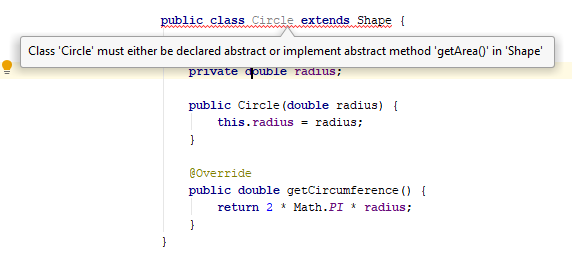
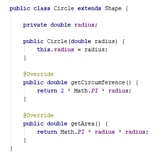

# Abstract classes

Students will be able to differentiate between abstract classes and interfaces and understand when to use an abstract class. 

- Topics:
   - Difference between abstract classes and interfaces
- Activity: to be added
- Sizing: 1 (smallest)

There are times when you want to implement _some_ behavior in a class, but you want to leave it to the developer to implement some other behavior.

For example, in our earlier example of the Shape class, we subtly provided a default implementation for the getCircumference and getArea methods
```java
public class Shape {
        public double getCircumference() {
            return 0;
        }

        public double getArea() {
            return 0;
        }
}

```

In that example, both returned 0.

Now suppose a developer implemented a subcass, such as Circle, and they were not clear that those two methods needed to be overridden to provide an implementation. Then they would leave those unimplemented, and we would suddenly find shapes with circumferences or areas equal to zero!

Abstract classes allow us to define _abstract_ methods, that _force_ the developer to define an implementation. If they don't, the Java compiler will fail.


An abstract method can only be defined in an abstract class. To define an abstract class, put _abstract_ before the words class:
```java

public abstract class Shape {
}
``` 
With that done, we can now define some abstract methods. These get a method signature and return type, but don't get an implementation. The return type must be preceded by the word _abstract_, as in the following example:

```java

public abstract class Shape {
        public abstract double getCircumference();

        public abstract double getArea();
}

```

Now, let's say we wanted to create a Circle subclass, but we forgot to implement the getArea method



You can see that IntelliJ warns us with a big red underline and a fat dialog, that our class is doomed to fail the compiler!

Implement the missing method, and everything is back to normal:



A common use of abstract classes, is to implement a _framework_, or _Template Method_ design pattern. This pattern allows the framework to define the larger behavior, leaving the particulars to the framework developer.

### Exercise - Monitor (Code along) 
Suppose we want to create a framework that does some (undefined) processing, and writes the results to a file. This is a common operation in monitoring applications, where input could be coming from a database, files, event logs, devices, pretty much anything.

We wish to process that information by writing individual "Monitor" subclasses, that calls the process method and writes the result to the file system.

Let's write a base abstract class called AbstractMonitor, with one abstract method called `process` that returns a String, and one non-abstract method called `writeFile(String fileName, String dataToWrite)`

Then let's write a subclass called MemoryMonitor that writes the current time and CPU utilization. 

```java
public abstract class AbstractMonitor {
    public abstract String  process();
    public void startMonitoring(String fileName) throws IOException, InterruptedException {
        while(true) {
            String value = process();

            RandomAccessFile file = new RandomAccessFile(fileName, "rw");
            file.seek(file.length());
            file.write(value.getBytes());
            file.writeChar('\n');
            Thread.sleep(1000);
        }
    }
}

public class MemoryMonitor extends AbstractMonitor {

    @Override
    public String process() {
        return new Date() + ":" + Runtime.getRuntime().freeMemory();
    }

    public static void main(String[] args) throws IOException, InterruptedException {
        new MemoryMonitor().startMonitoring("test.txt");
    }
}

```

Note to instructor: Execute this method, then open the test.txt file in IntelliJ and watch it refresh every second. If it does not refresh on its own, keep hitting Ctrl-Alt-Y every second or so and it will tail the file.
