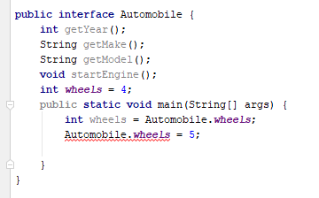

# Interfaces

Students will be able to define an interface in Java and understand when to use one.

- Topics:
    - Defining and Implementing an Interface
    - Programming to an Interface
- Activity: to be added.
- Sizing: 2 (small)

### Introduction
In Java an interface defines an API, essentially a contract 
that a class will contain the methods defined in the interface.

An interface is not a class; it cannot be instantiated. It does not inherit from Object. Again, it is just a contract that declares to the compiler that whatever instance is assigned to it, will contain the methods in the interface.

An interface is similar to an abstract class, in that its methods are declared but not defined. (Well, that was true until a few years ago when Java 8 was born. Since Java 8 you can also provide implementations in interface methods, and we will learn more about that later when we cover default methods in interfaces.)

### Defining an interface

All this will become clearer when we get into the sample code, but first let's see how to define an interface:
```java
public interface Automobile {
}
```
That defines the shell of an interface. The declaration of an interface is really very similar to a class, except that it uses the word _interface_ in place of _class_.
 
Like a class, an inteface can be public or default visibility.

Let's add some functionality to our Automobile:
```java
public interface Automobile {
    int getYear();
    String getMake();
    String getModel();
    void startEngine();
}
```
 
Our Automobile is now contracted to provide a year, make, and model, and some functionality to start the engine. Notice how these methods are defined exactly like abstract methods in abstract classes.

Now I can have some code that says something like:
```java
Automobile auto = getAutomobileById("12357"); // get an Automobile from our database
String make = auto.getMake();
String model = auto.getModel();
int year = auto.getYear();
auto.startEngine();
```

Note that we did not specify a visibility for the interface methods. That is because all interface methods are always public, and we should also mention they are always non-static.

### Implementing interfaces
To implement an interface means that you are committing to fulfill the interface contract for the class that implements it. 

The syntax is as follows:
```java
class MyClass implements MyInterface {
    
}
```
Where _MyClass_ is the class you are defining, and _MyInterface_ is the interface you are promising to enforce.

### Why interfaces?

Why is this important?
Think about it - let's say we are an auto manufacturing company, and last year we bought from you a large library of Java code for managing cars. Let's say we are coming out with a new kind of car, a new model called Tesla Satellite, and I want to use the functionality in your Automobile library.

All we have to do is implement your Automobile interface, and we can use your existing library to manage our new car that did not even exist when your library was written.

By _implementing_ your interface, the Java compiler will ensure that our new TeslaSatellite class has implemented all of the methods in our Automobile contract, err, interface, thus ensuring that it is usable by our libraries.


So let's implement those methods and try again

 
As we saw before, the @Override annotation is optional, but desirable. 

### Fields in interfaces
Surprisingly interfaces may contain field variables, but these fields _must_ be assigned values in the interface, they are static (they can be accessed from the interface name, as in the following example, or from any class that implements that interface. And these variables are final, they may not be changed, as indicated by the red underline in IntelliJ.



### Interfaces extending interfaces
Just like classes can extend classes, interfaces can extend other interfaces, and they inherit all of the methods of the base interface.

### Interfaces extending multiple interfaces
One important difference between classes and interfaces, is that where a class can only extend one class, an interface can extend many interfaces, and then it would inherit all of the methods (and fields) from all of the parent interfaces.  

### Classes implementing multiple interfaces
While a class cannot extend multiple classes, it is perfectly legal to _implement_ multiple interfaces. To do so, include a comma-separated list of interfaces to implement after the _implements_ keywords.
 
 So for example let's say we have interfaces defined for various qualities like Sentient, Sapient, Biped, etc.
 
 **(Note to instructor: In the exercises for this less, we will ask the class to create these interfaces. See code definitions in the src directory for this lesson.)**
 
 Then we could have:
 
```java class Person implements Satient, Sapient, Biped { etc.} ```

Then it would be perfectly legal to say
```java
Person person = new Person();
Sentient sentient = person;
Sapient sapient = person;
Biped Biped = person;
```
Each of the variables would contain the same instance, however you would only be allowed to call the methods exposed by the interface, depending on the variable.
So the following are all legal (assuming the interfaces define those methods):
```java
sentient.feel();
sapient.think();
biped.walk();
```

However the following is illegal
``` java
sentient.walk();
```
Since even though the instance is a person, the interface is a Sentient,and so you can only call methods from the Sentient interface.

This feature provides a way to have a sort of multiple inheritance in Java. For example, if you

### Difference between interfaces and abstract classes 
What is the difference between an interface and an abstract class? The main difference is that a class can only extend one class, abstract or not, whereas it can _implement_ many interfaces.  This can be useful in the use cases above, where we needed to refer to a single instance under different APIs.

So why use an abstract class ever? The short answer is that an abstract class allows you to provide some implementation, which is useful when you want to define some methods but not others, as we saw in our earlier example of the _Template Method_.

### Default methods in interfaces
In fact, that difference has started to blur since Java 8, when the ability to define _default methods_ was added to interfaces.

A default method essentially provides some functionality that we want to add to all classes that implement this interface. Such methods become public, non-static members of all implementing classes. And like any public method, they may be overridden by implementing class.

For example:
```java
public interface Sapient {
    void think();
    default void speak() {
        System.out.println("I think therefore I am!");
    }
}
```

Now our Person class (that implements Sapient) gets the _speak_ method:
```java
new Person().speak(); // displays I think therefore I am!
```

### Exercise - Creating and implementing interfaces

Let's create all of the interfaces we discussed in this lesson, and create a class that implements all of these. Then let's call all of the methods on the class.

|Interface|Methods| 
|---|---|
|Sapient| void think();
|Sentient| void feel();
|Biped| void walk();

Then add a default method to the Sapient method called void speak().

Finally, create a Person class that implements all of these interfaces. For the implementation, do `System.out.println("some appropriate message)`

Then assign it to variables of each of the types, Sapient, Sentient, Biped, and Person, and see what methods you can call on each. Place the variable name on a new line, followed by a dot. Then hit Ctrl-Space and IntelliJ will show you the methods you can call:

Solution: See src code and graphic:


Note that in this method display, the methods implemented directly are bolded, whereas the inherited methods (like clone and equals, which are inherited from Object) are just plain, not bolded.
