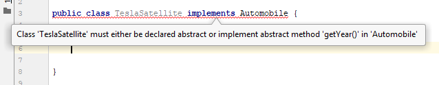

| Title | Type | Duration | Creator |
| --- | -- | -- | --- |
| Abstract Classes and Interfaces | Lesson | 1:25 | Victor Grazi, NYC |

#  Abstract Classes and Interfaces

### LEARNING OBJECTIVES
- Write an abstract class.
- Define an interface in Java.
- Understand when to use an abstract class vs. an interface.

### LESSON GUIDE

| TIMING  | TYPE  | TOPIC  |
|:-:|---|---|
| 5 min  | Opening  | Discuss lesson objectives | 
| 10 min | Demo | Abstract classes |
| 10 min | Guided Practice | Abstract classes in action |
| 10 min | Demo | Interfaces |
| 15 mins | Guided Practice | Implementing interfaces |
| 20 mins | Independent Practice | Creating and implementing interfaces |
| 10 mins | Demo | Breaking it down |
| 5 min  | Conclusion  | Review / Recap |

## Opening (5 mins)

There are times when you want to implement _some_ behavior in a class, but you want to leave it to the developer to implement some other behavior.

For example, in our earlier example of the `Shape` class, we subtly provided a default implementation for the `getCircumference()` and `getArea()` methods.

```java
public class Shape {
    public double getCircumference() {
        return 0;
    }

    public double getArea() {
        return 0;
    }
}

```

In that example, both returned 0.

Now suppose a different developer implemented a subclass, such as `Circle`, and they were not clear that the initial developer of the `Shape` class intended those two methods to be overridden to provide an implementation. Then they would leave those unimplemented, and we would suddenly find circles with circumferences and areas equal to zero! Whoops!

----

## Demo - Abstract Classes (10 mins)

To prevent this sort of communication breakdown, the developer of the `Shape` class can mark the class as an **abstract class**. Abstract classes allow us to define _abstract_ methods, that _force_ the developer to define an implementation. If they don't, the Java compiler will throw an error.

An abstract method can _only_ be defined in an abstract class. To define an abstract class, put _abstract_ before the word class:

```java
public abstract class Shape {
    // Contents
}
``` 

With that done, we can now define some abstract methods. These get a method signature and return type, but don't get an implementation. The return type must be preceded by the word _abstract_, as in the following example:

```java

public abstract class Shape {
        public abstract double getCircumference();

        public abstract double getArea();
}

```

By seeing this, the developer and the Java compiler both understand that there must be an implementation of a method called `getCircumference()` in a subclass of `Shape`, and that it must return a double. 

**What if we forget to implement a method marked as abstract?**

Let's say we wanted to create a `Circle` subclass, but we forgot to implement the `getArea()` method.


You can see that IntelliJ warns us with a big red underline and a fat dialog, that our class is doomed to fail the compiler!

Once we implement the missing method, and everything is back to normal:


----

## Guided Practice - Abstract classes in action (10 mins) 

A common use of abstract classes is to implement a _framework_, or _Template Method_ design pattern. This pattern allows the framework to define the larger behavior, leaving the particulars to the framework developer.

Suppose we want to create a framework that does some (undefined) processing and writes the results to a file. This is a common operation in monitoring applications, where input could be coming from a database, files, event logs, devices... pretty much anything. And it's a great use case for abstract classes!

> Note: We design the abstract class as purposely very generic so that subclasses can handle potentially any of these cases.

We wish to process that information by writing individual "Monitor" subclasses, that calls the process method and writes the result to the file system.

Let's write a base abstract class called `AbstractMonitor`, with an abstract method called `process()` that returns a String and a non-abstract method called `startMonitoring(String fileName)`. 

```java
public abstract class AbstractMonitor {
    public abstract String process();
    public void startMonitoring(String fileName) throws IOException, InterruptedException {
        while(true) {
            String value = process();

            RandomAccessFile file = new RandomAccessFile(fileName, "rw");
            file.seek(file.length());
            file.write(value.getBytes());
            file.writeChar('\n');
            Thread.sleep(1000);
        }
    }
}
```

Subclasses benefit from the `AbstractMonitor` class in that they don't have to rewrite the `startMonitoring(String filename)` method, they just have to worry about their own particular functionality for the `process` method.

For example, let's write a subclass called `MemoryMonitor` that writes the current time and CPU utilization. 

```java
public class MemoryMonitor extends AbstractMonitor {

    @Override
    public String process() {
        return new Date() + ":" + Runtime.getRuntime().freeMemory();
    }

    public static void main(String[] args) throws IOException, InterruptedException {
        new MemoryMonitor().startMonitoring("test.txt");
    }
}
```

----

## Demo - Interfaces (10 mins)

Let's switch gears to talking about interfaces. As we're walking through what an interface is and what it does, be thinking about how they compare and contrast to abstract classes.

In Java an interface defines an API, which is essentially a contract that a class will contain the methods defined in the interface.

> Note: We're using API as "application program interface", in that we know certain methods we can use to access something, in this case a Java class. You may have more coloquially heard the term "API" used to mean a web API, usually meant to access some sort of data. In the generic sense, application program interface describes that process as well.

An interface is not a class; it _cannot be instantiated_. It is just a contract that declares to the compiler that whatever instance is assigned to it will contain the methods in the interface. An interface is similar to an abstract class in that its methods are declared but not defined. 

All this will become clearer when we get into the sample code, but first, let's see how to define an interface:

```java
public interface Automobile {
    // Contents
}
```

That defines the shell of an interface. The declaration of an interface is really very similar to a class, except that it uses the word _interface_ in place of _class_. And like a class, an inteface can be public or default (package-private) visibility.

Let's add some functionality to our `Automobile` interface:

```java
public interface Automobile {
    int getYear();
    String getMake();
    String getModel();
    void startEngine();
}
```
 
Our Automobile is now contracted to provide a year, make, and model, and some functionality to start the engine. Notice how these methods are defined exactly like abstract methods in abstract classes.

Now I can have some code that says something like:

```java
Automobile auto = getAutomobileById("12357"); // get an Automobile from our database
String make = auto.getMake();
String model = auto.getModel();
int year = auto.getYear();
auto.startEngine();
```

Note that we did not specify a visibility for the interface methods. That is because all interface methods are always public, and we should also mention they are always non-static.

-----

## Guided Practice - Implementing Interfaces (15 mins)

To implement an interface means that you are committing to fulfill the interface contract for the class that implements it. 

The syntax is as follows:

```java
class MyClass implements MyInterface {
    
}
```

- _MyClass_ is the class you are defining
- _MyInterface_ is the interface you are promising to enforce

In a more concrete example, we might take our `Automobile` interface and create a `HondaAccord` class that looks like this:

```java
class HondaAccord implements Automobile {
    // Instance variable!
    public int year; 

    // Constructor
    public HondaAccord(year) {
        this.year = year;
    }

    // Methods that the interface needs
    @Override
    public int getYear() {
        return this.year;
    }

    @Override
    public String getMake() {
        return "Honda";
    }

    @Override
    public String getModel() {
        return "Accord";
    }

    @Override
    public void startEngine() {
        System.out.println("Vroom vroom!");
    }
}
```

### Why is this important?

Let's say we are an auto manufacturing company, and last year we bought from you a large library of Java code for managing cars. Let's say we are coming out with a new kind of car, a new model called Tesla Satellite, and I want to use the functionality in your Automobile library.

All we have to do is implement your Automobile interface, and we can use your existing library to manage our new car that did not even exist when your library was written. It was one thing to write a `HondaAccord` class since we already know everything about Hondas, but now we're really able to realize the usefulness of an interface.

By _implementing_ your interface, the Java compiler will ensure that our new `TeslaSatellite` class has implemented all of the methods in our Automobile contract, err, interface, thus ensuring that it is usable by our libraries.



So let's implement those methods and try again.


 
> Tip: As we saw before, the @Override annotation is optional, but desirable. 

### Fields in Interfaces

Surprisingly interfaces may contain field variables, but these fields _must_ be assigned values in the interface, they are static. Remember that static means the field can be accessed from the interface name, as in the following example, or from any class that implements that interface. And these variables are _final_, they may not be changed, as indicated by the red underline in IntelliJ.


### Extending, Extending, Extending

Just like classes can extend classes, interfaces can extend other interfaces, and they inherit all of the methods of the base interface. This is useful for complex systems we might find in real life.

Classes can also implement multiple interfaces! Let's take a look.

Think back to our `Automobile` interface. Imagine we also have a `TowVehicle` interface that deals with towing capability, carrying capacity, and fuel type. 

```java
public interface TowVehicle {
    int getCarryingCapacity();
    int getTowingCapacity();
    String getFuelType();
}
```

We might want to create a `DodgeRam` class that implements _both_ interfaces. To do so, include a comma-separated list of interfaces to implement after the _implements_ keywords, like this:

```java
class DodgeRam implements Automobile, TowVehicle {
    // Methods that the Automobile interface needs
    @Override
    public int getYear() {
        return 2019;
    }

    @Override
    public String getMake() {
        return "Dodge";
    }

    @Override
    public String getModel() {
        return "Ram";
    }

    @Override
    public void startEngine() {
        System.out.println("VROOM!");
    }

    // Methods that the TowVehicle class needs
    @Override
    int getCarryingCapacity() {
        return 2000;
    }

    @Override
    int getTowingCapacity() {
        return 13000;
    }

    @Override
    String getFuelType() {
        return "Diesel";
    }
}
```

Take a second to consider the `DodgeRam` class. What methods are legal to run on it compared to the `HondaAccord` and the `TeslaSatellite`?

---

## Independent Practice - Creating and implementing interfaces (20 mins)

Let's work through another example!

**Step 1**

Create three interfaces:

|Interface|Methods| 
|---|---|
|Sapient| void think(); |
|Sentient| void feel(); |
|Biped| void walk(); |

Add a default method to the `Sapient` method called `void speak()`.

**Step 2**

Create a `Person` class that implements all of these interfaces. For the implementation, do `System.out.println("some appropriate message")`

Then assign it to variables of each of the types, `Sapient`, `Sentient`, `Biped`, and `Person`, and see what methods you can call on each. 

> Tip: Want to use IntelliJ ike a pro? Place the variable name on a new line, followed by a dot. Then hit Ctrl-Space and IntelliJ will show you the methods you can call!

The solution is in the `src` directory.

-----

## Demo - Breaking it down (10 mins)
 
Our `Person` class implements three interfaces - `Sapient`, `Sentient`, and `Biped`.

It would be perfectly legal to say:

```java
Person person = new Person();
Sentient sentient = person;
Sapient sapient = person;
Biped biped = person;
```

Each of the variables would contain the same instance, however you would only be allowed to call the methods exposed by the interface, depending on the variable.

So the following are all legal (assuming the interfaces define those methods):

```java
sentient.feel();
sapient.think();
biped.walk();
```

However the following is illegal:

``` java
sentient.walk();
```

Since even though the instance is a person, the interface is a `Sentient`, and so you can only call methods from the `Sentient` interface.

This feature provides a way to have a sort of multiple inheritance in Java that is otherwise not supported.

----

## Demo - Interfaces vs Abstract Classes (10 mins)

Take a moment to think. What is the difference between an interface and an abstract class? 

The main difference is that a class can only extend one class, abstract or not, whereas it can _implement_ many interfaces. This can be useful in the use cases above, where we needed to refer to a single instance under different APIs.

So why use an abstract class ever? The short answer is that an abstract class allows you to provide *some* implementation, which is useful when you want to define some methods but not others, as we saw in our earlier example with the Monitors.

### Default Methods in Interfaces

In fact, the difference between abstract classes and interfaces has started to blur since Java 8, when the ability to define _default methods_ was added to interfaces.

A default method essentially provides some functionality that we want to add to all classes that implement this interface. Such methods become public, non-static members of all implementing classes. And like any public method, they may be overridden by implementing class.

For example:

```java
public interface Sapient {
    void think();
    default void speak() {
        System.out.println("I think therefore I am!");
    }
}
```

Now our Person class (that implements Sapient) gets the _speak_ method:

```java
new Person().speak(); // displays I think therefore I am!
```

----

## Conclusion (5 mins)

Both interfaces and abstract classes are used for abstraction. They're used in similar ways, but _interfaces_ are most useful when you don't have any shared code between the subclasses, unlike our Monitors example, in which all Monitors were able to share the `startMonitoring(String filename)` method.

Remember that interfaces:
* Cannot be instatiated
* Cannot be static
* Cannot implement methods

You should use an *abstract class* when:
* You need both static and non-static methods
* You need both abstract and non-abstract methods
* You don't want all your fields to be "final"

You should use *interfaces over abstract classes* when:
* You're defining 100% abstract methods
* You need future developers to follow a certain pattern (this is our contract!)
* You need to use more than one interface (remember a class can only extend one class!)

The difference is somewhat subtle. Both interfaces and abstract classes are used for abstraction, but the key takeaway for knowing which one to use is whether the classes that would implement or extend the interface or abstract class will *share lines of code*. 

This may require some thinking about your particular task or situation. There's no one right answer for each and every situation. It's okay though. We trust you!


## Extra Resources

Need some more examples about abstract classes and interfaces? Check out this [GeeksforGeeks article](https://www.geeksforgeeks.org/difference-between-abstract-class-and-interface-in-java/).

