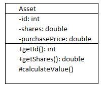
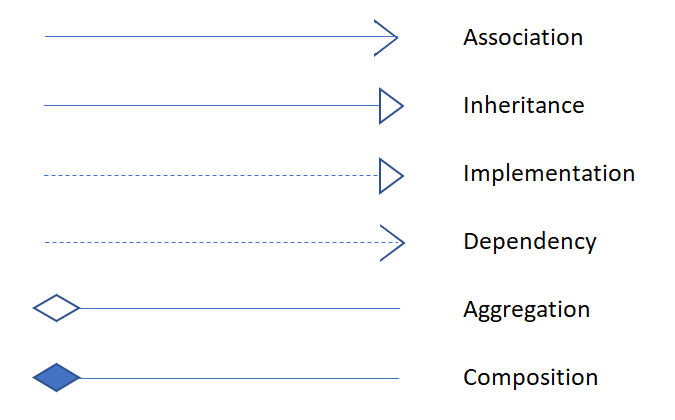

By now, you have seen many examples of some pretty terse code, that make even simple programs hard to follow.

Wouldn't it be great if we could express programs clearly, without having to plow through all of the arcane language syntax?

That is where UML comes in.

UML (Unified Modeling Language) is a graphic-based language that uses intuitive pictures to express program structure and interactions.

There are several categories of UML diagrams, including:
* Class diagrams - Represent the static structure of classes and their dependencies.
* Sequence diagrams - Represent the dynamic interactions between objects.
* Use case diagrams - Represent the high level dynamic capabilities of a system. 

and many others.

Using UML, a software architect or program designer can quickly describe the structure and interactions of a system in a model, and 
use those models to communicate implementation details to developers and engineers, much as a building architect can use blueprints to communicate the details of a building to the engineering staff. 

There are many tools in the market for preparing UML diagrams. There are specialized enterprise-quality tools like "Enterprise Architect" and IBM Rational, to free tools like ArgoUML, as well as general modeling tools like Lucidchart and Microsoft Visio. Many tools provide the capability to reverse engineer code, and to generate code from models. Usually the choice of tool will be dictated in your shop.

In this course, we will discuss the two most common UML diagrams - class diagrams and sequence diagrams. 

Imagine you are building a trading system for financial assets such as stocks, bonds, and commodities.

A trader will have a bokerage account, and they will log in, place a buy or sell order for a number of assets, and then log out. 

The broker must check if they have available credit, or require a cash payment. They will place the trade to the market, and capture the details on their internal database.

You'll notice that in our description of this system, we used words like, asset, stock, bond, commodity, trader, broker, market, credit, payment, and database.

These can all be modeled in a UML class diagram.

Briefly, a UML class or interface is represented as a rectangular box, with three horizontal sections:

* Top section holds the class name, 
* Middle section contains the field names, 
* Bottom section holds the method names.

Abstract classes and interfaces are represented by italicizing the class name. 

For example, let's model our Asset class, which is the base class for all assets:

From the diagram we can see that the class name is Asset, there are three fields id, shares, and purchasePrice, and there are three methods called getId, getShares, and calculateValue.

Notice that we prefixed the fields and methods with -, +, and #. These are examples of _visibility_ indicators. The full list of visibilities is as follows:

|Symbol|Meaning|
|:---:|---|
|+|public|
|-|private|
|#|protected|
|~|package (_default_, in Java)|

Following the field and method names is a colon and then the return type.

You can see how these diagrams contain sufficient information to generate the class structure. The programmers job would then be to fill in the implementation details and documentation. (Actually we are not seeing where the package name might be specified. We will get to that in a minute.)

A UML class diagram arranges these classes on a blank canvas, and then uses connector lines and arrows to represent the class inter-relationships.

The shapes of the lines and arrows indicate the kind of relationships

### Implements
### Extends
### Multiplicity

Even if you are not generating code from your UML, you can see the benefit of using UML over code for communicating code structure.

