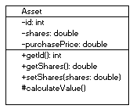
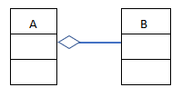
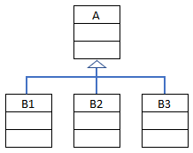

#  Class Diagrams

### Learning Objectives

*After this lesson, students will:*
* Understand the different categories of UML

- 

### Lesson Guide

| TIMING  | TYPE  | TOPIC  |
|:-:|---|---|
| 5 min | Opening  | Lesson Objectives |
| 10 min | Instruction | Intro to UML |
| 10 min | Instruction | Class Diagrams |

## Introduction (5 min)

By now, you have seen many examples of some pretty arcane code, that make even simple programs hard to follow.

Wouldn't it be great if we could express programs clearly, without having to plow through all of the terse language syntax?

That is where UML comes in.

In this course, we will discuss the two most common UML diagrams - class diagrams and sequence diagrams. 

---

### UML (10 min)

### What is UML?

UML (Unified Modeling Language) is a graphic-based language that uses intuitive pictures to express program structure and interactions.

There are several categories of UML diagrams, including:

* Class diagrams - Represent the static structure of classes and their dependencies.
* Package diagrams - Represent the relationships between packages.
* Sequence diagrams - Represent the dynamic interactions between objects.
* Use case diagrams - Represent the high level dynamic capabilities of a system. 

and many others.

### Using UML

Using UML, a software architect or program designer can quickly describe the structure and interactions of a system in a model, and 
use those models to communicate implementation details to developers and engineers, much as a building architect can use blueprints to communicate the details of a building to the engineering staff. 

There are many tools in the market for preparing UML diagrams. There are specialized enterprise-quality tools like "Enterprise Architect" and IBM Rational, to free tools like ArgoUML, as well as general modeling tools like Lucidchart and Microsoft Visio. Many tools provide the capability to reverse engineer code, and to generate code from models. Usually the choice of tool will be dictated in your shop.

## Class Diagrams (10 min)

Imagine you are building a trading system for financial assets such as stocks, bonds, and commodities.

A trader will have a bokerage account, and they will log in, place a buy or sell order for a number of assets, and then log out. 

The broker must check if they have available credit, or require a cash payment. They will place the trade to the market, and capture the details on their internal database.

You'll notice that in our description of this system, we used words like, asset, stock, bond, commodity, trader, broker, market, credit, payment, and database.

These can all be modeled in a UML class diagram.

Briefly, a UML class or interface is represented as a rectangular box, with three horizontal sections:

* Top section holds the class name, 
* Middle section contains the field names, 
* Bottom section holds the method names.

Abstract classes and interfaces are represented by italicizing the class name. 

For example, let's model our Asset class, which is the base class for all assets:  

From the diagram we can see that the class name is "Asset", there are three fields: "id", "shares", and "purchasePrice", and there are four methods: "getId", "getShares", "setShares", and calculateValue.

Notice that we prefixed the fields and methods with -, +, and #. These are examples of _visibility_ indicators. The full list of visibilities is as follows:

|Symbol|Meaning|
|:---:|---|
|+|public|
|-|private|
|#|protected|
|~|package (_default_, in Java)|

To specify the type of field or the return type of a method, the field or method name is followed by a colon and then the return type. 

You can see how these diagrams contain sufficient information to generate the class structure. The programmers job would then be to fill in the implementation details and documentation. 

A UML class diagram arranges these classes on a blank canvas, and then uses connector lines and arrows to represent the class inter-relationships.

The shapes of the lines and arrows indicate the kind of relationships, as follows:

Basically the connectors indicate the kind of relationship. Some of the differences are subtle, so let's discuss each of them:

### Association
  
Association connector depicts that class A _has a field_ of type B

### Dependency
  
Dependency connector depicts that class A might not have a field of type B, but that it uses type B as an import, for example as a local type in a method.

### Aggregation
  
Aggregation and Composition are subsets of Association, i.e. kinds of Association, and in fact the generated code would be identical. Where Association just indicates that class A has a field of type B, Aggregation indicates that class A has a field of type B, but that B can exist independently of A. 

### Composition

Where Aggregation indicates that A refers to B but B can exist without A, Composition indicates that B is a vital part of A

A building has rooms and it has a superintendent. If you take away the superindendent, you still have a building (for a while!) That is aggregation. But if you take away the rooms, the building ceases to exist. That is composition. And both are associations.

### Order of arrows
Note the direction of the arrows. In assocation, the arrow head is on the dependent class, whereas with aggregation and composition, the rombus is on the containing class.

### Inheritance
  
Inheritance connectors indicate the subclasses of a class, i.e. the classes that extend a class. In this example class B extends class A. Generally the subclass is drawn below the base class, and the inheritance arrow is drawn pointing upward. That is consistent with the naming convention we saw earlier, where "upcasting" is the operation of casting a subclass to its base class, and "downcasting" is the operation of casting a class to a subclass. Up and down refer to the direction of the inheritance arrow.

To indicate several subclasses, we generally merge the arrows as follows:  
  
In this diagram, classes B1, B2, and B3 all extend class A

### Implementation
  
Implementation is similar to inheritance, except the class A is an interface, and the arrow indicates that class B implements interface A.

### Multiplicity
You can also include multiplicity indicators on the connecting arrows, some number greater than or equal to 0, or a *.

In the following, we see that a cat has up to 4 legs, and a leg belongs to at most 1 cat.  
  

---

## Student Activity (30 min)

Let's get started coding our Trading system from existing models.  Here is the class diagram for a trading system.
  

We will add the implementation details later, in the lesson on sequence diagrams, but for now, your activity is to generate the Java classes represented in this diagram.

Note that Market is an interface, as indicated by the italics. All of the others are concrete (non-abstract) classes.

---

## Conclusion (5 min)

The amount of detail included in a UML diagram depends on the level of granularity you are trying to convey. If you just want to convey the high-level class relationships, you can omit some or all of the fields and methods.

Even if you are not generating code from your UML, you can see the benefit of using UML over code for communicating code structure.

